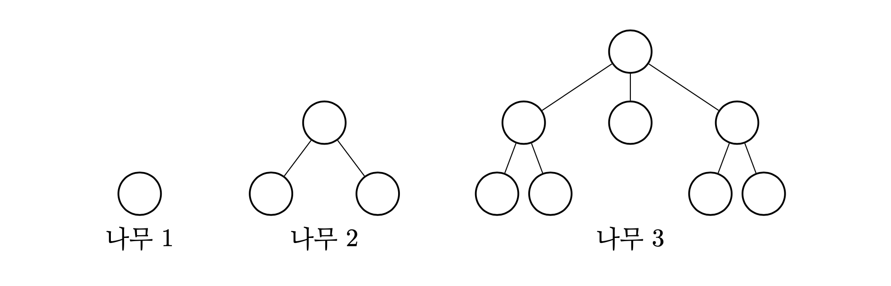
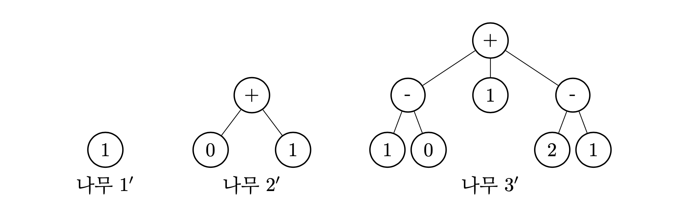
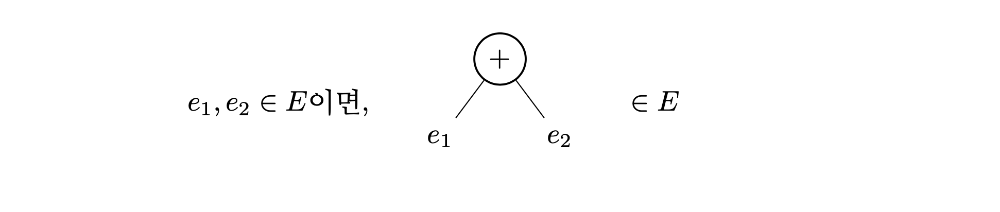
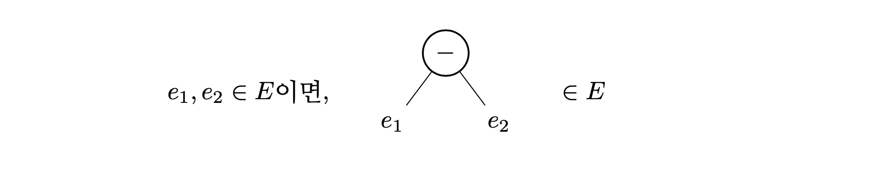
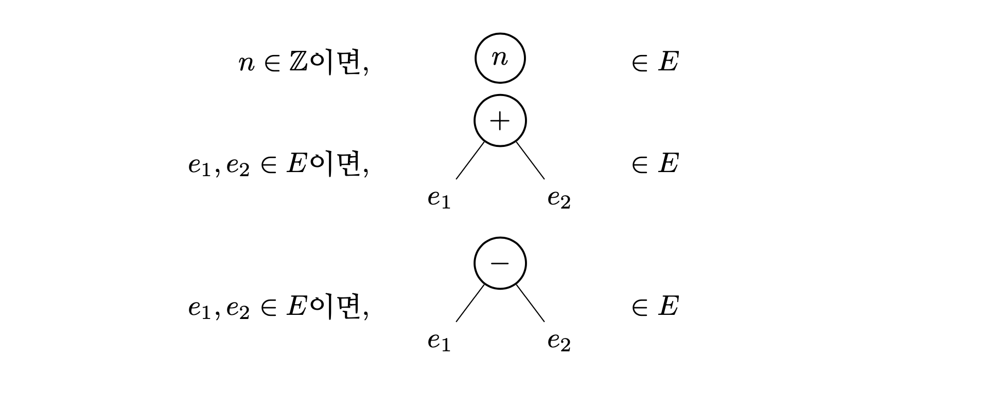
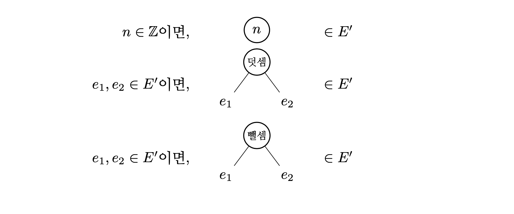

**아래 내용은 인사이트 출판사의 제안으로 작성 중인 책의 초고입니다. 실제 출판
시에는 내용이 달라질 수 있습니다. 많은 의견 부탁드립니다.**

구체적 문법은 어떤 문자열이 프로그램인지 알려 주지만 프로그램이 어떤 구조를
가지는지 설명하지는 못한다. 그러나 프로그래밍 언어의 의미를 정의하고 이해하려면
프로그램의 구조를 정확하게 표현할 수 있어야 한다. 프로그램의 구조를 설명하는
문법이 요약 문법이다. 일반적으로 프로그램은 나무(tree) 구조를 가진다. 프로그램이
나무 구조로는 표현될 수 없는 프로그래밍 언어를 정의하는 것도 가능하기는 하다.
그러나 널리 사용되는 언어 중에는 그런 경우를 찾아볼 수 없으므로 프로그램은 나무
구조를 가지는 것으로 간주하겠다.

요약 문법에 대해 알아보기 전에 나무가 무엇인지 이해해야 한다. 여기서 나무는
그래프 이론에서 사용하는 나무로, 프로그래밍 경험이 있는 사람이라면 이진 탐색
나무(binary search tree) 같은 자료 구조를 사용하면서 들어 보았을 것이다. 원래
그래프 이론에서의 나무는 순환(cycle)이 없는 연결된 그래프(connected graph)를
말한다. 프로그래밍에서 등장하는 나무도 같은 성질을 가지지만, 굳이 그래프 이론의
정의를 사용하는 것보다는 다음의 정의가 자연스러울 것이다.

“나무는 하나의 뿌리 노드와 0개 이상의 유한한 자식 나무로 이루어진 그래프이다.”

그러므로 다음과 같은 구조를 나무 구조라고 할 수 있다.

그림에서 원은 노드, 원과 원을 잇는 선분은 두 노드를 연결하는 간선이다. 나무 1은
뿌리 노드만 가지고 있는 나무이다. 나무 2는 뿌리 노드에 두 개의 자식 나무가 달려
있으며 각각의 자식 나무는 뿌리 노드만 가지고 있다. 나무 3은 세 개의 자식 나무를
가지고 있으며, 첫 자식 나무와 세 번째 자식 나무는 나무 2와 같은 구조이고 두 번째
자식 나무는 나무 1과 같은 구조이다.

위의 정의에 더해, 프로그램의 구조를 표현하는 나무에서는 각 노드가 값을 가진다.
여기서 값이란 수학적인 아무 대상을 이야기한다. 정수나 실수 같은 수, 문자나
문자열, 임의로 정의된 이름 등 여러 대상이 모두 값이 될 수 있다. 예를 들어 아래와
같이 나무의 노드에 값을 붙일 수 있다.

각 원 안의 대상이 그 노드의 값이다. 여기서 0, 1, 2는 수 0, 1, 2를 뜻하고, +와
-는 임의로 정의한 이름이다.

이제 프로그램이 어떻게 나무 구조로 표현될 수 있는지 산술의 예시를 통해
알아보겠다. 산술에서는 하나의 산술식이 하나의 프로그램이다. 앞서 산술의 구체적
문법을 살펴보았다. 산술의 구체적 문법은 프로그램인 문자열의 집합을 정의한다.
배커스-나우르 형식을 사용하기는 했지만, 이는 어디까지나 집합을 정의하는 한 가지
방법일 뿐 배커스-나우르 형식 자체가 구체적 문법인 것은 아니다. 다시 말해, 구체적
문법이 정의한 것은 다음의 집합이다.

\[\langle expr\rangle = \{ “0”, “1”, \cdots “-999”, \cdots, “0+0”, \cdots “-999+-999+-999”, \cdots “0-0”,
“-999-999+-999”, \cdots \}\]

반면 산술의 요약 문법은 프로그램의 구조를 나무를 통해 표현한다.

정수 하나는 산술의 프로그램이라는 사실부터 시작하자. \(E\)가 프로그램의 구조를
나타내는 나무의 집합이라 할 때, 다음 사실이 성립한다.

(\(\mathbb{Z}\)는 정수의 집합이다.)
여기서 \(n\)은 임의의 정수이다. 즉, 뿌리 노드로만 이루어져 있으며 뿌리 노드의 값이
어떤 정수인 나무는 \(E\)의 원소라는 사실을 적은 것이다.

두 프로그램을 덧셈을 통해 결합한 것 역시 프로그램이다. 그러므로 다음의 사실이
성립한다.

여기서 \(e_1\)과 \(e_2\)는 \(E\)의 원소이다. 뿌리 노드가 +라는 이름을 가지고 두 자식 나무가
\(E\)의 원소인 나무는 \(E\)의 원소이다. 이처럼, 요약 문법은 뿌리 노드에 결합 방식을
적고 결합 대상을 자식 나무로 하여 여러 원소들을 결합해 새로운 원소를 만들어
낸다.

덧셈과 비슷한 방법을 통해 뺄셈도 추가할 수 있다.

\(e_1\)과 \(e_2\)는 \(E\)의 원소이다.

이로써 산술의 요약 문법을 모두 정의했다. 한 데 모아 다시 써 보면 다음과 같다.

정의로부터 아까 본 나무들 중 나무 1'과 2'은 프로그램의 구조를 표현하는
나무지만 나무 3'은 그렇지 않다는 사실을 알 수 있다.

나무 1'은 뿌리 노드로만 이루어져 있고 뿌리 노드의 값이 정수 1이므로 \(E\)의
원소이다. 비슷하게 뿌리 노드로만 이루어져 있고 뿌리 노드의 값이 0인 나무도 \(E\)의
원소이다. 따라서 나무 2'는 뿌리 노드의 이름이 +이고 두 자식 나무가 모두 \(E\)의
원소인 나무이므로 \(E\)의 원소이다. 이렇게 요약 문법에 따라 프로그램의 구조를
나타내는 나무를 요약 문법 나무(abstract syntax tree; AST)라고 부른다. 즉, 나무
1'과 2'은 산술의 요약 문법 나무이다. 한편 나무 3'은 세 개의 자식 나무를 가지고
있지만 정의에 따르면 \(E\)의 원소 중 자식이 셋인 나무는 없으므로 나무 3'은 \(E\)의
원소가 아니다.

요약 문법에서 이름은 별로 중요한 대상이 아니다. +라는 이름 대신 덧셈이라는
이름을 사용하고 -라는 이름 대신 뺄셈이라는 이름을 사용하여 아래와 같이 \(E'\)을
정의할 수도 있다.

이전 정의와 이름이 달라졌으므로 \(E\)와 \(E'\)은 서로 다른 집합이다. 그러나 두 집합의
나무들이 가지는 구조는 일치한다. 즉, \(E\)와 \(E'\)은 동형(isomorphic)이라고 말할 수
있다. 조금 더 자세히 말하자면 \(E\)와 \(E'\) 사이의 일대일대응 함수를 쉽게 정의할 수
있다는 것이다. 이 이상의 수학적 설명으로 들어가는 것은 이 책의 범위를 넘어가는
것이라고 생각하기 때문에 더 깊은 설명은 하지 않겠다. 단순히 두 집합의 구조가
똑같이 생겼다고 직관적으로 이해하면 충분하다. 요약 문법에서 중요한 것은
어디까지나 구조일 뿐이다. 그렇기에 \(E\)와 \(E'\)은 요약 문법의 관점에서는 같은
정의로서 사용될 수 있다.

프로그램이 나무 구조를 가지는 것은 사실이나 매번 나무를 그려서 프로그램을
표현하는 것은 다소 거추장스러운 일이다. 그래서 사람들은 나무를 그리는 대신
수학적 표기법을 사용해 프로그램을 나타낸다. 표기법은 정하기에 달린 것이기에
사람마다 조금씩 다른 표기법을 사용할 수는 있으나 대개 큰 차이가 없다. 이
책에서도 보편적으로 사용되는 표기법을 소개한다. 먼저, 뿌리 노드만 가지는
나무를 표기할 때는 원을 그리지 않는다. 따라서 다음과 같이 쓸 수 있다.

\(n \in Z\)이면 \(n \in E\)

자식 나무를 가지는 나무를 표기할 때는 뿌리 노드의 이름과 자식 나무를 한 줄로
적으며 그 순서는 원하는 대로 정할 수 있다. 단, 한 번 정한 순서는 일관적으로
지켜야 한다. 다음은 한 가지 가능한 표기 방법이다.

\(e_1, e_2 \in E\)이면 \(e_1 + e_2 \in E\)

\(e_1, e_2 \in E\)이면 \(e_1 - e_2 \in E\)

표기 방법을 정했으니 이제 나무를 직접 그리는 대신 쉽게 적을 수 있다. 나무 1'과
2'을 적으면 각각 \(0\)과 \(0 + 1\)이 된다.

또, 더 복잡한 나무도 쉽게 적을 수 있다. 필요하다면 어떤 나무를 표기한 것인지
명확하게 보여 주기 위해 수학에서 사용하는 것처럼 괄호를 사용할 수 있다. 다음의
나무는 \(3 - (2 + 1)\)이라고 적을 수 있다.

만약 그냥 \(3 - 2 + 1\)이라고만 적으면 아래의 나무를 의미하는 것이라 생각할 수도
있기 때문에 괄호를 사용한 것이다.

위에서 정한 표기 방법 이외에도 다양한 표기 방법을 만들 수 있다. 먼저, 순서를
바꾸어 다음과 같이 적을 수도 있다.

\(e_1, e_2 \in E\)이면 \(+\ e_1\ e_2 \in E\)

\(e_1, e_2 \in E\)이면 \(e_1\ e_2\ - \in E\)

또한, 앞서 말했듯이 이름은 요약 문법에서 중요하지 않으므로 다른 이름을 사용할
수도 있다.

\(e_1, e_2 \in E\)이면 \(e_1\ 연산[가]\ e_2 \in E\)

\(e_1, e_2 \in E\)이면 \(e_1\ 연산[나]\ e_2 \in E\)

+와 -는 그저 이름일 뿐 아무런 뜻도 없기 때문에 연산[가]와 연산[나]라는 이름을
대신 사용해 보았다. 다만, 조금 더 직관적으로 알아보기 쉬운 이름을 사용해
표기하는 것이 일반적인 선택이다. 필요하다면 뿌리 노드와 자식 나무들의 앞뒤에
추가적인 기호를 붙여 보기 좋게 만들 수도 있다.

\(e_1, e_2 \in E\)이면 \({+\ e_1\ e_2} \in E\)

\(e_1, e_2 \in E\)이면 \({-\ e_1\ e_2} \in E\)

이렇게 여러 가지 방법으로 요약 문법을 표기했지만 모두 동일하게 아래의 요약
문법에 대한 표기법인 것이다.

정리해 보면, 다음은 산술의 요약 문법을 한 가지 수학적 표기법을 사용해 정의한
것이다.

\(n \in Z\)이면 \(n \in E\)

\(e_1, e_2 \in E\)이면 \(e_1 + e_2 \in E\)

\(e_1, e_2 \in E\)이면 \(e_1 - e_2 \in E\)

이 밖에도 다양한 표기법이 사용될 수 있다.

표기법은 표기하는 사람이 정하기에 달린 것이기에, 요약 문법에 대해 다룰 때는
표기법에 대해 신경 쓰는 대신 그 표기를 통해 나타내고자 하는 나무 구조 자체에
관심을 두는 것이 중요하다. 수학에서 \(\times\)라는 기호를 곱셈을 나타내기 위해
사용하는 이유를 궁금해 하는 것이 재미있는 이야깃거리가 될 수는 있다. 그러나
곱셈의 개념을 이해하는 데는 전혀 도움되지 않을 것이다. 마찬가지로, 요약 문법의
표기법을 왜 그렇게 정했는지 묻는 것은 별 의미 없는 일이다. 그저 그 표기법을
통해 나타내려는 나무 구조를 파악할 수 있으면 충분하다.

배커스-나우르 형식은 문자열의 집합을 정의하는 데 사용될 뿐 아니라 요약 문법을
간략하게 정의하는 데도 사용된다. 현재 산술의 요약 문법을 정의하는 방법은
다음과 같다.

\(n \in Z\)이면 \(n \in E\)

\(e_1, e_2 \in E\)이면 \(e_1 + e_2 \in E\)

\(e_1, e_2 \in E\)이면 \(e_1 - e_2 \in E\)

같은 내용을 배커스-나우르 형식을 사용해 다음과 같이 정의할 수도 있다.

\(e\ ::=\ n\ |\ e + e\ |\ e - e\)

단, \(n \in \mathbb{N}\)이고 \(e \in E\)이다. 구체적 문법을 정의하기 위해 배커스-나우르 형식을
사용할 때는 문자열의 집합을 정의하는 것이었지만, 요약 문법을 정의하기 위해
배커스-나우르 형식을 사용할 때는 나무의 집합과 그 나무를 표기하는 방법을
정의하는 것이다. 똑같은 배커스-나우르 형식을 약간 다른 용도로 사용했다는 점에
유의하기 바란다. 즉, 위에서 배커스-나우르 형식을 사용해 한 줄 적은 것은 \(E\)라는
나무의 집합을 정의하고 그 나무의 원소들을 표기하는 방법을 정한다. \(E\)라는
집합에는 아래에 있는 나무 1'과 2'가 속하고 두 나무를 정한 표기법에 따라 적으면
\(1\)과 \(0 + 1\)이 된다.

