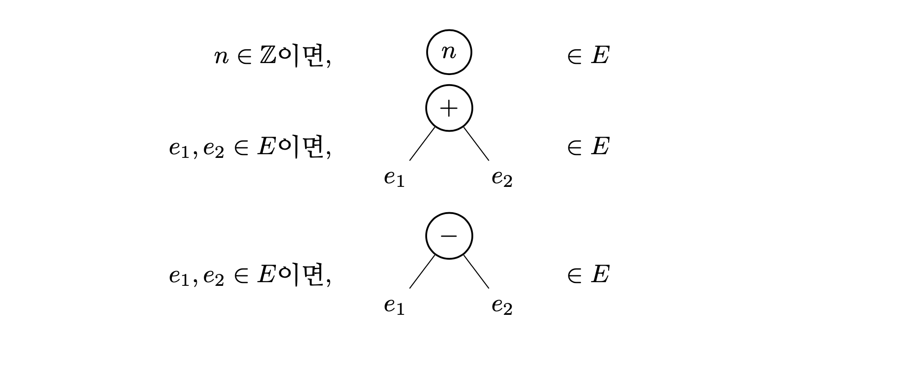

**아래 내용은 인사이트 출판사의 제안으로 작성 중인 책의 초고입니다. 실제 출판
시에는 내용이 달라질 수 있습니다. 많은 의견 부탁드립니다.**

지금까지 문법에 대해 알아보았다. 문법이 있어야 무슨 문자열이 프로그램인지 알 수
있고 프로그램이 어떤 구조인지 알 수 있으니 문법은 언어의 매우 중요한 요소이다.
그러나 문법만 있어서는 반쪽짜리밖에 되지 못한다. 프로그램은 실행하기 위해
작성하는 것이니 실행할 수 없는 프로그램은 아무리 많아 봤자 아무런 쓸모가 없다.
결국 프로그램은 실행했을 때 일어나는 일이 가장 핵심이다. 프로그램을 실행하면
어떤 일이 일어나는지 정하는 것이 바로 언어의 의미가 하는 일이다.

지금부터 언어의 의미를 정의해 보겠다. 앞에서 사용한 `산술`의 예시를 계속 사용할
것이다. 즉, 하나의 프로그램은 하나의 산술식이다.

의미를 정의하는 작업은 요약 문법을 사용한다. 프로그램이 실행되면 일어나는 일은
프로그램의 구조에 따라 달라진다. 요약 문법이 하는 일이 프로그램의 구조를
표현하는 것이니, 의미를 정의하기 위해서 요약 문법을 사용하는 것이 자연스럽다.
앞에서 본 산술식의 요약 문법을 다시 떠올리면 프로그램의 요약 문법은 다음과 같다.

\(e\ ::=\ n\ |\ e + e\ |\ e - e\)

또는 나무를 그려서 표현할 수도 있다.

이제 `산술`의 의미를 정의할 차례이다. `산술`의 의미는 각 프로그램의 의미를 정의하며,
각 프로그램의 의미는 그 프로그램을 실행하면 벌어지는 일을 정의한다. `산술`의
프로그램은 산술식이다. 산술식을 실행한다는 것이 뭘까? 일반적으로 프로그램을
실행한다는 것은 시작할 때 주어진 메모리 상태를 변경하는 것이다. 여기서 메모리라
함은 주 기억 장치를 의미한다. 때로는 그 과정 중에 파일 입출력이나 네트워크
입출력과 같은 외부와의 상호작용도 수행한다. 큰 범주에서 보면 파일 입출력과
네트워크 입출력도 결국은 보조 기억 장치나 네트워크 장비의 상태를 변화시키는
일이라 생각할 수 있다. 다시 말해, 프로그램이 실행 중에 하는 일은 어떤 주어진
외부 상태를 변화시키는 것이다. 그러나 산술식이 외부 상태를 변화시킬 수 있을 리
없다. 그 대신 계산을 통해 하나의 수를 결과로 낼 수 있다. 하나의 수를 내놓는 것이
산술식의 의미인 것이다.

예를 들면, \(0 + 1\)이라는 프로그램은 \(1\)이라는 수를 결과로 내는 것이 바람직해 보인다.
즉, \(0 + 1\)의 의미는 \(1\)이어야 한다는 것이다. 조금 더 친숙하게 표현하자면 \(0 + 1\)의
실행 결과는 \(1\)이라고도 할 수 있다. 물론, 아직 우리는 `산술`의 의미를 정의하지
않았으니 \(0 + 1\)의 의미가 \(1\)이라고 말할 수 없다. 이미 \(0 + 1\)의 의미가 \(1\)이라는 사실을
이미 알고 있는 것이 아니냐는 의문을 가지는 사람도 있을 것이다. 그러나 그것은
+라는 이름 때문에 생기는 착각일 뿐이다. 현재 +는 두 요약 문법 나무를 결합해
새로운 요약 문법 나무를 만드는 역할을 할 뿐, 그 이상의 어떤 뜻도 가지고 있지
않다. 앞에서 본 것처럼 + 대신 연산[가]라는 이름을 쓰면 이 점이 더 명확하게
느껴질 것이다. \(0\ 연산[가]\ 1\)의 의미는 아직까지 정의되지 않았으므로 아무도 모른다.
우리가 하고 싶은 일은 \(0\ 연산[가]\ 1\)의 의미가 \(1\)이 되도록 `산술`의 의미를 정의하는
것이다.

모든 프로그램의 의미를 정의하려면 각각의 프로그램의 의미를 정해 주는 것보다는
좋은 방법이 필요하다. 무수히 많은 수의 프로그램이 존재하니 하나하나 정해서는
끝이 없기 때문이다. 다행히 요약 문법이 산술식의 의미를 정의하는 데 실마리를
제공한다. 요약 문법에 따르면 세 가지 종류의 프로그램이 존재한다. \(n\), \(e_1 + e_2\),
\(e_1 - e_2\)가 바로 그 세 종류이다. 한 종류에 해당하는 모든 프로그램의 의미를 한 번에
정해 버린다면, 그 작업을 세 번만 하면 모든 프로그램의 의미를 정의할 수 있다.
각각의 종류에 대해 의미를 정의해 보자.

가장 간단한 경우는 \(n\)이다. 여기서 \(n\)은 앞에서 정의했듯 임의의 정수이다. 어떤
정수를 계산한 결과는 그 정수 자신이다. 그러므로 \(n\)의 의미는 \(n\)이다. 이를 다음과
같이 적겠다.

**규칙 1:**

\(\ \ \ \ \)\(n\)의 실행 결과가 \(n\)이다.

따라서 규칙 1을 통해 다음과 같은 사실들을 알아낼 수 있다.

* \(0\)의 실행 결과가 \(0\)이다.
* \(1\)의 실행 결과가 \(1\)이다.

이제 \(e_1 + e_2\) 차례이다. \(e_1\)과 \(e_2\)는 임의의 프로그램이다. 아직 우리는 프로그램의
의미를 다 정의하지 않았다. 그러나 앞으로 프로그램의 의미를 다 정의할 것이다.
그렇기에 \(e_1\)과 \(e_2\)의 의미를 이미 알고 있다고 가정하겠다. 프로그래밍 경험이 있는
사람이라면 재귀 함수를, 수학 공부를 해 본 사람이라면 귀납적 증명을 떠올리면
된다. 지금 정의하고 있는 대상을 미리 빌려와 사용하는 것이다. \(e_1\)의 의미는 어떤
수이다. 그 수를 \(n_1\)이라고 하겠다. \(e_2\)의 의미도 어떤 수이다. 그 수는 \(n_2\)라 하겠다.
그러면 \(e_1 + e_2\)의 의미는 \(n_1 + n_2\)이다. 여기서 주의해야 할 점은 \(e_1 + e_2\)와
\(n_1 + n_2\)에서 \(+\) 기호를 서로 다른 뜻으로 사용한다는 것이다. \(e_1 + e_2\)에서의 \(+\)는 요약
문법을 정의하면서 정한 표기법으로, \(e_1\)이 나타내는 나무와 \(e_2\)가 나타내는 나무를
자식 나무로 하는 새로운 나무를 만들고 그 나무를 \(e_1 + e_2\)라 쓰겠다는 것이다. 한편,
\(n_1 + n_2\)에서의 \(+\)는 \(n_1\)과 \(n_2\)가 모두 수이므로 수학에서의 덧셈을 의미한다. 즉,
\(n_1 + n_2\)는 \(n_1\)과 \(n_2\)의 합이다. \(+\)라는 하나의 기호를 두 가지 용도로 사용하기는 했지만
사용한 맥락을 보면 둘 중 어느 용도로 사용한 것인지 어렵지 않게 알 수 있다.
그러나 이번 장은 의미에 대해 처음 설명하는 장이니 헷갈리지 않도록 수의 덧셈을
나타내는 \(+\)를 \(+^\mathbb{Z}\)라고 쓰겠다. 다음 장부터는 특별히 구분해야 할 이유가 없다면 \(+\)를
요약 문법의 표기와 수학의 덧셈 모두를 위해 사용하겠다. 이에 따라 다시 쓰면
\(e_1 + e_2\)의 의미는 \(n_1 +^\mathbb{Z} n_2\)이다. 그러면 아래와 같이 쓸 수 있다.

**규칙 2:**

\(\ \ \ \ \)\(e_1\)의 실행 결과가 \(n_1\)이고 \(e_2\)의 실행 결과가 \(n_2\)이면,

\(\ \ \ \ \)\(e_1 + e_2\)의 실행 결과가 \(n_1 +^\mathbb{Z} n_2\)이다.

이제 규칙 2로부터 \(0\)의 계산 결과가 \(0\)이고 \(1\)의 실행 결과가 \(1\)이면, \(0 + 1\)의 실행
결과가 \(0 +^\mathbb{Z} 1\)이라는 사실을 알 수 있다. 우리는 이미 규칙 1로부터 \(0\)의 실행 결과가
\(0\)이고 \(1\)의 실행 결과가 \(1\)이라는 사실을 알고 있었다. 그러므로 \(0 + 1\)의 실행 결과가
\(0+^\mathbb{Z} 1\)이라는 결론을 얻을 수 있다. \(0 +^\mathbb{Z} 1\)은 간단한 초등학교 수학에 의해 \(1\)과 같음을
알 수 있다. 따라서 \(0 + 1\)의 실행 결과가 \(1\)이다.

\(e_1 + e_2\)와 비슷한 방법으로 \(e_1 - e_2\)의 의미도 정의할 수 있다. 먼저 \(e_1\)의 의미와 \(e_2\)의
의미를 이미 알고 있다고 가정하자. \(e_1\)의 의미는 \(n_1\), \(e_2\)의 의미는 \(n_2\)라고 할 것이다.
그러면 \(e_1 - e_2\)의 의미는 \(n_1 - n_2\)이다. 마찬가지로, 여기서도 \(-\)가 두 가지 용도로
사용되었다. 이번 장에서만큼은 수학의 뺄셈을 \(-^\mathbb{Z}\)라고 쓰겠다. 그러면 \(e_1 - e_2\)의
의미는 \(n_1 -^\mathbb{Z} n_2\)이다. 이를 아래와 같이 쓸 수 있다.

**규칙 3:**

\(\ \ \ \ \)\(e_1\)의 실행 결과가 \(n_1\)이고 \(e_2\)의 실행 결과가 \(n_2\)이면,

\(\ \ \ \ \)\(e_1 - e_2\)의 실행 결과가 \(n_1 -^\mathbb{Z} n_2\)이다.

프로그램의 의미가 모두 정의되었다. 우리는 이제 어떤 프로그램이든 실행 결과를 알
수 있다. 예를 들어 \((2 + 3) - (4 - 1)\)이라는 프로그램을 생각해 보자. 다음 과정을
통해 이 프로그램의 실행 결과를 찾을 수 있다.

* 가: (규칙 1에 따라) \(2\)의 실행 결과가 \(2\)이다.
* 나: (규칙 1에 따라) \(3\)의 실행 결과가 \(3\)이다.
* 다: (규칙 2에 따라) \(2\)의 실행 결과가 \(2\)이고 \(3\)의 실행 결과가 \(3\)이면, \(2 + 3\)의 실행
결과가 \(2 +^\mathbb{Z} 3\)이다.
* 라: (가, 나, 다에 따라) \(2 + 3\)의 실행 결과가 \(2 +^\mathbb{Z} 3\)이다. 한편 \(2 +^\mathbb{Z} 3\)은 \(5\)이다.
따라서 \(2 + 3\)의 실행 결과가 \(5\)이다.
* 마: (규칙 1에 따라) \(4\)의 실행 결과가 \(4\)이다.
* 바: (규칙 1에 따라) \(1\)의 실행 결과가 \(1\)이다.
* 사: (규칙 3에 따라) \(4\)의 실행 결과가 \(4\)이고 \(1\)의 실행 결과가 \(1\)이면, \(4 - 1\)의 실행
결과가 \(4 -^\mathbb{Z} 1\)이다.
* 아: (마, 바, 사에 따라) \(4 - 1\)의 실행 결과가 \(4 -^\mathbb{Z} 1\)이다. 한편 \(4 -^\mathbb{Z} 1\) 은 \(3\)이다.
따라서 \(4 - 1\)의 실행 결과가 \(3\)이다.
* 자: (규칙 3에 따라) \(2 + 3\)의 실행 결과가 \(5\)이고 \(4 - 1\)의 실행 결과가 \(3\)이면,
\((2 + 3) - (4 - 1)\)의 실행 결과가 \(5 -^\mathbb{Z} 3\)이다.
* 차: (라, 아, 차에 따라) \((2 + 3) - (4 - 1)\)의 실행 결과가 \(5 -^\mathbb{Z} 3\)이다. 한편 \(5 -^\mathbb{Z}
3\)은 \(2\)이다. 따라서 \((2 + 3) - (4 - 1)\)의 실행 결과가 \(2\)이다.

(차)로부터 \((2 + 3) - (4 - 1)\)의 실행 결과가 \(2\)라는 사실을 알 수 있다.

한 눈에 볼 수 있게 산술식의 의미를 정의하는 세 규칙을 한 데 모아 다시 쓰겠다.

**규칙 1:**

\(\ \ \ \ \)\(n\)의 실행 결과가 \(n\)이다.

**규칙 2:**

\(\ \ \ \ \)\(e_1\)의 실행 결과가 \(n_1\)이고 \(e_2\)의 실행 결과가 \(n_2\)이면,

\(\ \ \ \ \)\(e_1 + e_2\)의 실행 결과가 \(n_1 +^\mathbb{Z} n_2\)이다.

**규칙 3:**

\(\ \ \ \ \)\(e_1\)의 실행 결과가 \(n_1\)이고 \(e_2\)의 실행 결과가 \(n_2\)이면,

\(\ \ \ \ \)\(e_1 - e_2\)의 실행 결과가 \(n_1 -^\mathbb{Z} n_2\)이다.

수학적 설명 (클릭하여 열고 닫기)

이제 `산술`의 의미를 조금 더 수학적으로 엄밀하게 만들어 보겠다. 우선, 의미라는
것이 무엇인지 다시 정의하겠다. 앞서 `산술`의 의미는 각 프로그램의 실행 결과를
정의한다고 했다. 여기서 실행 결과는 어떤 수, 더 정확하게는 어떤 정수이다.
그러므로 `산술`의 의미라는 것은 어떤 프로그램이 주어졌을 때 그 프로그램을 실행하여
나오는 정수를 알려주는 것이다. 따라서 `산술`의 의미는 프로그램에서 정수로 가는
함수이다.

\[의미: E \rightarrow \mathbb{Z}\]

의미가 함수라는 것은 모든 \(E\)의 원소 \(e\)에 대해 \(\mathbb{Z}\)의 원소인 \(의미(e)\)가 유일하게
존재한다는 것이다. `산술`의 경우에서는 이 사실이 성립한다. 어떤 프로그램이든 실행
결과가 존재한다. 또, 어느 프로그램이든 그 프로그램을 실행한 결과는 유일하다.

그러나 일반적인 언어를 고려하면 의미를 함수로 정의하는 것은 좋은 선택이 아니다.
먼저, 어떤 프로그램을 실행한 결과가 존재하지 않을 수 있다. 실행이 끝나지 않는
프로그램이나 실행 중 오류를 일으키는 프로그램이 그러한 프로그램에 해당한다. 이런
프로그램의 예시는 다음 장부터 볼 수 있다. 둘째로, 어떤 프로그램을 실행한 결과가
유일하지 않을 수 있다. 대표적인 예시로는 여러 스레드를 사용하는 병행(concurrent)
프로그램이 있다. 두 스레드의 명령이 무작위 순서로 번갈아 가며 실행된다. 명령이
실행된 순서에 따라 프로그램의 결과가 달라질 수 있기 때문에 한 프로그램을 실행한
결과가 여럿이 될 수 있다. 위의 두 가지 중 한 가지에만 해당하더라도 언어의 의미를
단순하게 프로그램에서 실행 결과로 가는 함수로 정의할 수 없다. 그래서 일반적으로
언어의 의미는 관계(relation)로 정의한다. 물론 `산술`은 굉장히 단순한 언어이기
때문에 둘 모두에 해당하지 않으며 의미를 함수로 정의하는 데 전혀 문제가 없다.
그러나 다음 장부터는 언어의 의미를 관계로 정의해야만 하기에 이번 장부터 언어의
의미를 관계로 정의할 것이다.

먼저 관계가 무엇인지 살펴보자. 집합 \(A\)와 집합 \(B\)의 관계는 \(A\)와 \(B\)의 곱집합인 \(A
\times B = \{ (a, b)\ |\ a \in A \land b \in B \}\)의 부분 집합이다. (\(\land\)는 논리곱을
의미한다. 즉, “\(a \in A \land b \in B\)”는 “\(a \in A\)이고 \(b \in B\)”임을 뜻한다.)
따라서 \(R\)이 \(A\)와 \(B\)의 관계이면 \(R \subseteq A \times B\)를 만족한다. 이때, \((a, b) \in
R\)이면 \(a\ R\ b\)라고 표기한다.

`산술`의 의미는 프로그램과 정수의 관계이다.

\[의미 \subseteq E \times \mathbb{Z}\]

만약 프로그램 \(e\)를 실행한 결과가 \(n\)이라면 \((e, n) \in 의미\)이다. 지금부터 표기를
살짝 바꾸어 의미를 정의하는 관계를 \(\Rightarrow\)라 쓰겠다.

\[\Rightarrow \subseteq E \times \mathbb{Z}\]

그러면 \(e\)를 실행한 결과가 \(n\)이면 \((e, n) \in \Rightarrow\)이며 \(e \Rightarrow
n\)이라고도 쓸 수 있다. \(e\)의 실행 결과가 \(n\)이라는 사실을 꽤 직관적으로 보여 주는
표기법이다. 이런 이유로 \(\Rightarrow\)는 언어의 의미를 정의할 때 널리 사용되는
표기법 중 하나이다. \(\Downarrow\)도 많이 사용되지만 이 책에서는 \(\Rightarrow\)로
통일하겠다. 어디까지나 표기 하는 방법을 약속한 것일 뿐이다. 화살표가 아닌 다른
어떤 기호를 사용해도 무방하다는 것을 기억하기를 바란다.

이제 `산술`의 의미를 정의하는 규칙을 다시 써 보겠다.

**규칙 1:**

\(\ \ \ \ n \Rightarrow n\)

**규칙 2:**

\(\ \ \ \ e_1 \Rightarrow n_1\)이고 \(e_2 \Rightarrow n_2\)이면,

\(\ \ \ \ e_1 + e_2 \Rightarrow n_1 +^\mathbb{Z} n_2\)

**규칙 3:**

\(\ \ \ \ e_1 \Rightarrow n_1\)이고 \(e_2 \Rightarrow n_2\)이면,

\(\ \ \ \ e_1 - e_2 \Rightarrow n_1 -^\mathbb{Z} n_2\)

새로 쓴 규칙을 사용해 \((2 + 3) - (4 - 1)\)의 실행 결과도 다시 구해 보겠다.

* 가: (규칙 1에 따라) \(2 \Rightarrow 2\)
* 나: (규칙 1에 따라) \(3 \Rightarrow 3\)
* 다: (규칙 2에 따라) \(2 \Rightarrow 2\)이고 \(3 \Rightarrow 3\)이면, \(2 + 3 \Rightarrow 2
+^\mathbb{Z} 3\)이다.
* 라: (가, 나, 다에 따라) \(2 + 3 \Rightarrow 2 +^\mathbb{Z} 3\)이다. 한편 \(2 +^\mathbb{Z} 3\)은 \(5\)이다.
따라서 \(2 + 3 \Rightarrow 5\)이다.
* 마: (규칙 1에 따라) \(4 \Rightarrow 4\)이다.
* 바: (규칙 1에 따라) \(1 \Rightarrow 1\)이다.
* 사: (규칙 3에 따라) \(4 \Rightarrow 4\)이고 \(1 \Rightarrow 1\)이면, \(4 - 1 \Rightarrow 4
-^\mathbb{Z} 1\)이다.
* 아: (마, 바, 사에 따라) \(4 - 1 \Rightarrow 4 -^\mathbb{Z} 1\)이다. 한편 \(4 -^\mathbb{Z} 1\) 은 \(3\)이다.
따라서 \(4 - 1 \Rightarrow 3\)이다.
* 자: (규칙 3에 따라) \(2 + 3 \Rightarrow 5\)이고 \(4 - 1 \Rightarrow 3\)이면, \((2 + 3) -
(4 - 1) \Rightarrow 5 -^\mathbb{Z} 3\)이다.
* 차: (라, 아, 차에 따라) \((2 + 3) - (4 - 1) \Rightarrow 5 -^\mathbb{Z} 3\)이다. 한편 \(5 -^\mathbb{Z} 3\)은
\(2\)이다. 따라서 \((2 + 3) - (4 - 1) \Rightarrow 2\)이다.

(차)로부터 \((2 + 3) - (4 - 1) \Rightarrow 2\)라는 사실을 알 수 있다.

여기에 한 가지 표기법을 더 도입하려고 한다. 지금부터는 추론 규칙(inference
rule)이라는 개념을 사용해 언어의 의미를 정의할 것이다. 추론 규칙은 주어진
명제들로부터 새로운 명제를 증명하기 위한 규칙이다. 추론 규칙은 다음과 같은
형태로 작성한다.

\[
\frac
{ [전제]\quad [전제]\quad \cdots\quad [전제] }
{ [결론] }
\]

추론 규칙은 가로선 하나, 가로선 위의 명제들, 가로선 밑의 명제 하나로 구성된다.
가로선 위의 명제들은 전제(premise)라 부르고 가로선 밑의 명제는
결론(conclusion)이라 부른다. 추론 규칙이 의미하는 바는 가로선 위의 전제가 모두
참이라면 결론 역시 참이라는 것이다. 하나의 추론 규칙에는 0개 이상의 전제가 있을
수 있다. 만약 전제가 하나도 없다면 그 추론 규칙은 결론이 반드시 참이라는 것을
뜻한다.

예를 들어, 전건 긍정(modus ponens)을 생각해 보자. 전건 긍정은 “\(P\)이면 \(Q\)”라는
사실을 알고 있고 \(P\)라는 사실도 알고 있을 때 \(Q\)라고 결론지을 수 있음을 말한다.
여기서 \(P\)와 \(Q\)는 임의의 명제를 의미한다. “소크라테스가 사람이면 소크라테스는
죽는다”가 사실이고 “소크라테스가 사람이다”가 사실이면 “소크라테스는 죽는다”도
사실이라는 것이 전건 긍정의 예시이다. 전건 긍정을 추론 규칙으로 쓰면 아래와
같다.

\[
\frac
{ P이면\ Q \quad  P }
{ Q }
\]

수리논리학에 익숙한 사람이라면 “\(P\)이면 \(Q\)”를 \(P \rightarrow Q\)라 쓸 것이다.

\[
\frac
{ P \rightarrow Q   \quad P }
{ Q }
\]

비슷하게 후건 부정(modus tollens)도 추론 규칙으로 쓸 수 있다. 후건 부정은 “\(P\)이면
\(Q\)”라는 사실을 알고 있고 \(Q\)가 거짓임을 알고 있을 때 \(P\)도 거짓이라고 결론지을 수
있음을 말한다. “돌멩이가 사람이면 돌멩이는 죽는다”가 사실이고 “돌멩이는 죽지
않는다”가 사실이면 “돌멩이는 사람이 아니다”도 사실임을 후건 부정을 통해 알 수
있다.

\[
\frac
{ P이면\ Q\quad  Q가\ 거짓 }
{ P가\ 거짓 }
\]

수리논리학에 익숙하다면 “\(P\)가 거짓” 대신 \(\neg P\)라 쓰는 것이 나을 것이다.

\[
\frac
{ P \rightarrow Q \quad  \neg Q }
{ \neg P }
\]

또, 어떤 정수 n에 대해 n은 언제나 n과 같다. 따라서 이를 다음처럼 추론 규칙으로
표현할 수 있다.

\[
\frac
{}
{n = n}
\]

만약 전제가 하나도 없으면 가로선을 생략할 수 있다.

\[n = n\]

이제 추론 규칙을 사용해 `산술`의 의미를 정의해 보겠다.

**규칙 1:**

\[n \Rightarrow n\]

**규칙 2:**

\[
\frac
{ e_1 \Rightarrow n_1 \quad e_2 \Rightarrow n_2 }
{ e_1 + e_2 \Rightarrow n_1 +^\mathbb{Z} n_2 }
\]

**규칙 3:**

\[
\frac
{ e_1 \Rightarrow n_1 \quad  e_2 \Rightarrow n_2 }
{ e_1 - e_2 \Rightarrow n_1 -^\mathbb{Z} n_2 }
\]

간결하면서도 명확하게 의미를 정의할 수 있다.

위의 세 추론 규칙을 사용해 \((2 + 3) - (4 - 1) \Rightarrow 2\)를 증명할 수 있다.
추론 규칙을 사용한 증명을 보기 쉽게 쓰는 방법은 증명 나무(proof tree)를 그리는
것이다. 다음의 과정에 따라 증명 나무를 그릴 수 있다.

먼저, 규칙 1로부터 \(2 \Rightarrow 2\)임을 증명할 수 있다. 규칙 1은 전제가 없으므로
\(2 \Rightarrow 2\)는 자연스럽게 참이다. 따라서 \(2 \Rightarrow 2\)라고 쓰는 것이 \(2
\Rightarrow 2\)의 증명 나무이다. 비슷하게 \(3 \Rightarrow 3\)이라 쓰는 것이 \(3
\Rightarrow 3\)의 증명 나무이다.

그 다음으로는 규칙 2를 사용해 \(2 + 3 \Rightarrow 5\)임을 증명할 수 있다. 단, 이때 \(2
\Rightarrow 2\)와 \(3 \Rightarrow 3\)이라는 전제가 참이어야 한다. 따라서 \(2 + 3
\Rightarrow 5\)의 증명 나무는 아래와 같다.

\[
\frac
{ 2 \Rightarrow 2 \quad 3 \Rightarrow 3 }
{ 2 + 3 \Rightarrow 5 }
\]

여기서 \(2 \Rightarrow 2\)와 \(3 \Rightarrow 3\)은 단순히 명제를 쓴 것이 아니라 증명
나무를 그린 것이다.

비슷한 방식으로 \(4 - 1 \Rightarrow 3\)의 증명 나무도 그릴 수 있다.

\[
\frac
{4 \Rightarrow 4 \quad 1 \Rightarrow 1 }
{ 4 - 1 \Rightarrow 3}
\]

마지막으로 \((2 + 3) - (4 - 1) \Rightarrow 2\)를 증명할 차례이다. 이를 증명하기
위해서는 \(2 + 3 \Rightarrow 5\)와 \(4 - 1 \Rightarrow 3\)라는 전제가 참이어야 한다.
우리는 그 둘이 참이라는 사실을 이미 알고 있으며 각각의 증명 나무도 가지고 있다.
두 증명 나무를 사용해 \((2 + 3) - (4 - 1) \Rightarrow 2\)의 증명 나무를 완성할 수
있다.

\[
\frac
{
  \frac
  {2 \Rightarrow 2 \quad  3 \Rightarrow 3}
  {2 + 3 \Rightarrow 5} \quad
  \frac
  {4 \Rightarrow 4 \quad 1 \Rightarrow 1}
  {4 - 1 \Rightarrow 3}
}
{ (2 + 3) - (4 - 1) \Rightarrow 2 }
\]

위 증명 나무는 그 자체로 \((2 + 3) - (4 - 1) \Rightarrow 2\)의 증명이다. 이로써 \((2 +
3) - (4 - 1)\)의 실행 결과가 \(2\)라는 사실이 언어의 의미에 입각하여 증명되었다.

**--수학적 설명 끝--**

지금까지 자연어를 통해, 약간의 수학적 개념과 함께, 추론 규칙을 사용해 각각의
방법으로 `산술`의 의미를 정의해 보았다. `산술`이 일반적인 언어에 비해 너무 단순한
것은 사실이다. 그러나 이번 장에서 본 의미의 정의 방법에 약간의 변화를 주는
것만으로 실용적인 언어에서 사용되는 대부분의 기능을 표현할 수 있다. 어떻게 여러
기능의 의미를 정의할 수 있는지 앞으로 차근차근 보게 될 것이다.

사실 언어의 의미를 정의하는 방법은 하나가 아니다. 이 책에서 사용하고 있는 방법은
큰 걸음 의미(big-step semantics)라고 부르는 정의 방법으로, 직관적으로 이해하기
가장 쉽다는 장점이 있다. 동시에 언어나 프로그램의 성질을 엄밀히 다루기에는
불편한 점이 많기 때문에 학계에서는 잘 사용되지 않는 방법이기도 하다. 그러나
프로그래밍 언어의 기본 원리를 소개하는 이 책의 목적에는 큰 걸음 의미가 가장 잘
어울린다. 앞으로의 내용에서도 큰 걸음 의미만을 사용해 언어의 의미를 정의할
것이다.

### 언어의 의미를 정의하는 다양한 방법

언어의 의미를 정의하는 방법에는 크게 두 종류가 있다. 첫 번째는 결과
의미(denotational semantics)이다. 이름에서 알 수 있듯이 결과 의미는 프로그램의
의미를 결과에 집중해서 표현한다. 결과 의미를 사용하면 한 프로그램의 의미는
하나의 수학적 값으로 나온다. 결과 의미는 도메인 이론 등의 다양한 수학적 도구를
필요로 하기에 이해하는 데 많은 수학적 지식을 필요로 한다. 그 대신 프로그램의
성질을 수학적으로 매우 엄밀하게 표현할 수 있다. 두 번째는 과정 의미(operational
semantics)이다. 과정 의미는 결과 의미에 비해 프로그램의 실행 과정을 잘 드러낸다.
과정 의미는 다시 큰 걸음 의미와 작은 걸음 의미(small-step semantics)로 나눌 수
있다. 작은 걸음 의미는 큰 걸음 의미보다 계산 순서를 표현하기 더 좋고 종료되지
않는 프로그램을 쉽게 나타낼 수 있다. 이런 장점으로 인해 작은 걸음 의미 역시
언어의 성질을 표현하는 데 많이 사용된다.
