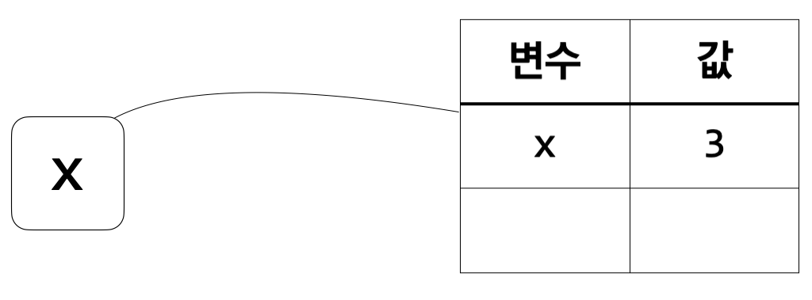
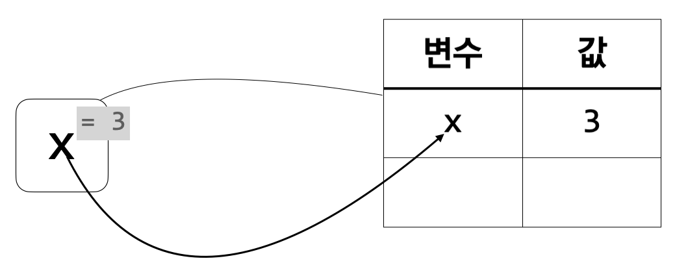
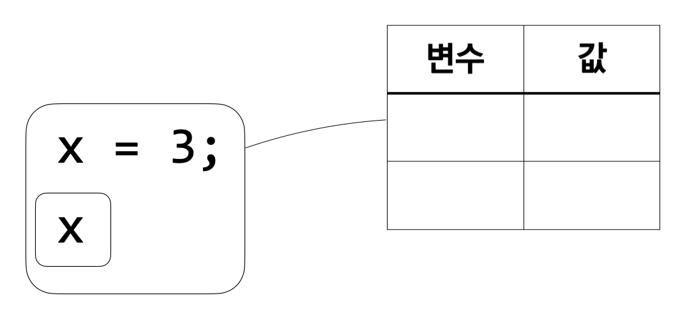
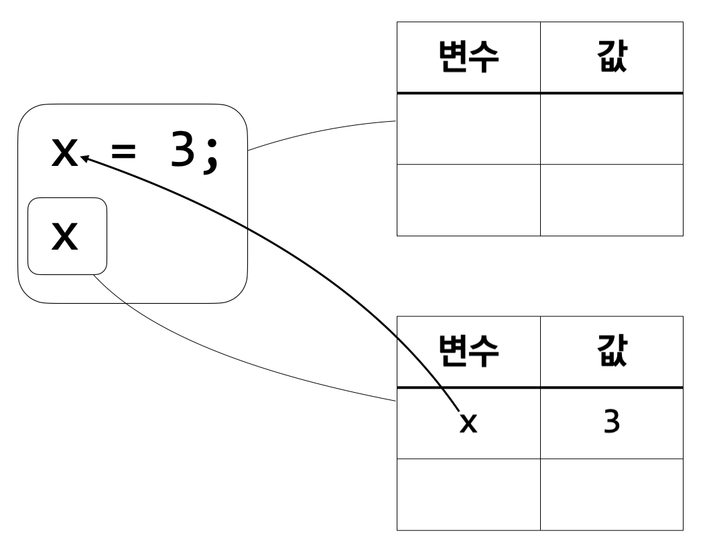
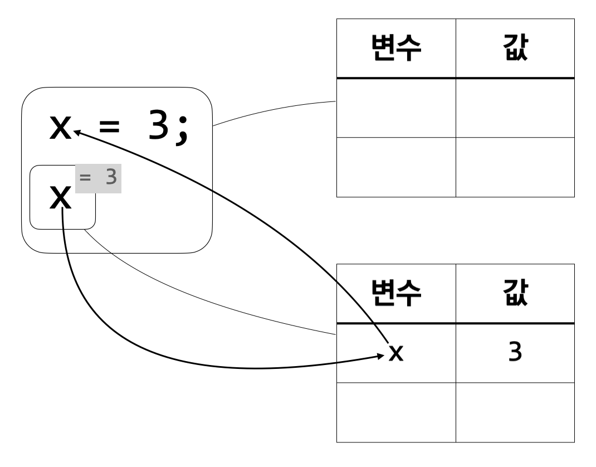

**아래 내용은 인사이트 출판사의 제안으로 작성 중인 책의 초고입니다. 실제 출판
시에는 내용이 달라질 수 있습니다. 많은 의견 부탁드립니다.**

이제 변수를 사용하는 방법을 알아보겠다. 앞의 파이썬 예시에서 `print(squareOf3 +
squareOf3)`이 변수를 사용하는 식이다. 더 정확하게 보면 `print(squareOf3 +
squareOf3)`의 부분식인 `squareOf3`이 그 자체로 변수를 사용하는 식이다. `squareOf3`은
변수 이름이자 하나의 식으로서, 이 식을 계산한 결과는 `squareOf3`이라는 이름의
변수가 나타내는 값이다. 이로부터 변수를 사용하는 방법은 사용하고자 하는 변수의
이름을 적는 것임을 알 수 있다. 또, 변수 이름 자체가 하나의 식이 될 수 있다.

위의 예시에서 본 변수를 사용하는 방법에 따라, `산술x`의 요약 문법에 변수를
사용하는 식을 추가할 수 있다.

\(e\ ::=\ \ldots\ |\ x\)

식으로서의 \(x\)는 변수를 사용하는 식이다. 이제부터 설명을 하면서 `산술x` 식을 예시로
들 텐데, 요약 문법에서 임의의 변수를 나타내는 데 사용된 \(x\)와 `산술x` 식에서
사용하는 변수의 이름 \(\tt x\)가 헷갈릴 여지가 있다. 이를 방지하기 위해 `산술x` 식에
등장하는 변수의 이름은 다른 글꼴을 사용하여 \(\tt x\)나 \(\tt y\) 등으로 적도록 하겠다.

변수 사용의 요약 문법을 정의했으니 변수 사용의 의미를 정의할 차례이다. 먼저
`산술`의 의미부터 돌아보자.

**규칙 1:**
\(\ \ \ \ \)\(n\)의 실행 결과가 \(n\)이다.

**규칙 2:**
\(\ \ \ \ \)\(e_1\)의 실행 결과가 \(n_1\)이고 \(e_2\)의 실행 결과가 \(n_2\)이면,
\(\ \ \ \ \)\(e_1 + e_2\)의 실행 결과가 \(n_1 + n_2\)이다.

**규칙 3:**
\(\ \ \ \ \)\(e_1\)의 실행 결과가 \(n_1\)이고 \(e_2\)의 실행 결과가 \(n_2\)이면,
\(\ \ \ \ \)\(e1 - e2\)의 실행 결과가 \(n1 - n2\)이다.

(2장에서 말했듯, 이번 장부터는 수학의 덧셈과 뺄셈을 표기하는 데 \(+^\mathbb{Z}\)와
\(-^\mathbb{Z}\) 대신
그냥 \(+\)와 \(-\)를 사용한다.) 변수 사용의 의미를 정하려면 “\(x\)의 실행 결과가 \(n\)이다”라고
말하는 규칙을 만들어야 한다. \(x\)의 실행 결과는 \(x\)라는 이름의 변수가 나타내는
값이다. 그런데 이 규칙에는 \(x\)라는 이름의 변수에 대한 정보를 제공해 줄 존재가
없다. 변수 \(x\)의 값을 알아낼 방법이 없는 것이다. 따라서 변수의 값을 알려 줄 새로운
개념을 언어의 의미에 추가해야 한다.

변수의 값을 알기 위해서는 사용할 수 있는 변수의 값들을 모두 저장하는 일종의 저장
공간이 필요하다. 우리는 이 저장 공간을 환경(environment)이라 부른다. 환경을 첫
열에는 변수의 이름, 둘째 열에는 변수의 값이 쓰여 있는 하나의 표라고 생각해도
된다. 환경을 언어의 의미에 추가함으로써 변수 사용의 의미를 정의할 수 있다.
변수의 값을 알려면 환경에서 찾아보면 되는 것이다. 환경이 더해졌으니 이제부터 식
\(e\)의 의미는 “\(e\)의 실행 결과가 \(n\)이다”라는 형태로 정의할 수 없다. “\(\sigma\)에서 \(e\)의
실행 결과가 \(n\)이다”가 식 \(e\)의 의미를 정의하는 새 방법이다. 여기서 \(\sigma\)는 임의의
환경을 나타낸다.

이제 변수 사용의 의미를 정의하는 규칙을 작성해 보겠다.

**규칙 4:**

\(\ \ \ \ \)\(\sigma\)에 \(x\)의 값이 \(n\)이라는 정보가 있으면,

\(\ \ \ \ \)\(\sigma\)에서 \(x\)의 실행 결과가 \(n\)이다.

이제 이 규칙에 따라 \(\tt x\)라는 식의 실행 결과를 찾을 수 있다. 예를 들어, \(\tt x\)의 값이
\(3\)이라는 정보를 가진 환경에서 \(\tt x\)의 실행 결과를 아래와 같이 구할 수 있다. 편의상
\(\tt x\)의 값이 \(3\)이라는 정보를 가진 환경을 \([{\tt x}\mapsto3]\)이라고 쓰겠다.

* 가: \([{\tt x}\mapsto3]\)에 \(\tt x\)의 값이 \(3\)이라는 정보가 있다.
* 나: (규칙 4에 따라) \([{\tt x}\mapsto3]\)에 \(\tt x\)의 값이 \(3\)이라는 정보가 있으면,
\([{\tt x}\mapsto3]\)에서 \(\tt x\)의 실행 결과가 \(3\)이다.
* 다: (가, 나에 따라) \(\tt x\)의 실행 결과가 \(3\)이다.

이해하기 쉽도록, \(\tt x\)의 값이 \(3\)이라는 정보를 가진 환경에서 \(\tt x\)의 실행 결과를 구하는
과정을 그림으로도 보겠다.

우측에 보이는 표가 환경을 나타낸다. \(\tt x\)를 둘러싼 상자가 환경에 연결되어 있는 것은
\(\tt x\)를 계산할 때 이 환경을 사용해야 함을 뜻한다.

환경에 \(\tt x\)가 존재하므로 \(x\)의 값을 알 수 있으며 그 값은 \(3\)이다.

변수를 포함하는 더 복잡한 식의 실행 결과도 알아낼 수 있다. 다만 아직까지 정수,
합, 차의 의미를 정의하는 규칙은 환경을 고려하지 않는다. 이 규칙들도 환경에 따라
실행 결과를 정하도록 수정해 주어야 한다.

**규칙 1:**

\(\ \ \ \ \)\(\sigma\)에서 \(n\)의 실행 결과는 \(n\)이다.

정수는 변수가 아니므로 정수의 실행 결과는 환경에 영향받지 않는다. 따라서
“\(\sigma\)에서”라는 말이 추가될 뿐, 실제로 실행 결과를 구하는 데 환경 \(\sigma\)를
사용하지는 않는다. 한편, 합을 표현하는 식 \(e_1 + e_2\)는 \(e_1\)과 \(e_2\)라는 두
부분식으로 구성된다. \(e_1 + e_2\) 자체에는 변수가 보이지 않지만 \(e_1\)이나 \(e_2\)는
변수를 사용하는 식일 수 있다. 그러므로 \(e_1\)과 \(e_2\)를 계산할 때 환경을 고려해야
한다.

**규칙 2:**

\(\ \ \ \ \)\(\sigma\)에서 \(e_1\)의 실행 결과가 \(n_1\)이고 \(\sigma\)에서 \(e_2\)의 실행 결과가 \(n_2\)이면,

\(\ \ \ \ \)\(\sigma\)에서 \(e_1 + e_2\)의 실행 결과가 \(n_1 + n_2\)이다.

두 부분식을 계산할 때 환경을 쓸 수 있도록 합의 의미에 대한 규칙을 고쳤다. \(e_1 +
e_2\)를 계산할 때 주어진 환경을 \(e_1\)과 \(e_2\)를 계산할 때 그대로 사용하는 것이
자연스러우므로, \(e_1 + e_2\)를 \(\sigma\)에서 계산하려면 \(e_1\)과 \(e_2\)를 각각 \(\sigma\)에서
계산해야 한다. 차의 의미를 정의하는 규칙도 비슷하게 바꾸어 주면 된다.

**규칙 3:**

\(\ \ \ \ \)\(\sigma\)에서 \(e_1\)의 실행 결과가 \(n_1\)이고 \(\sigma\)에서 \(e_2\)의 실행 결과가 \(n_2\)이면,

\(\ \ \ \ \)\(\sigma\)에서 \(e_1 - e_2\)의 실행 결과가 \(n_1 - n_2\)이다.

이제 바뀐 규칙에 따라 실행 결과를 계산하는 예시를 보자. \(\tt x\)의 값이 \(3\)이라는 정보를
가진 환경에서 \({\tt x} + 2\)의 실행 결과를 구할 것이다.

* 가: \([{\tt x}\mapsto3]\)에 \(\tt x\)의 값이 \(3\)이라는 정보가 있다.
* 나: (규칙 4에 따라) \([{\tt x}\mapsto3]\)에 \(\tt x\)의 값이 \(3\)이라는 정보가 있으면,
\([{\tt x}\mapsto3]\)에서 \(\tt x\)의 실행 결과가 \(3\)이다.
* 다: (가, 나에 따라) \(\tt x\)의 실행 결과가 \(3\)이다.
* 라: (규칙 1에 따라) \([{\tt x}\mapsto3]\)에서 \(2\)의 실행 결과가 \(2\)이다.
* 마: (규칙 2에 따라) \([{\tt x}\mapsto3]\)에서 \(\tt x\)의 실행 결과가 \(3\)이고 \([{\tt x}\mapsto3]\)에서 \(2\)의
실행 결과가 \(2\)이면, \([{\tt x}\mapsto3]\)에서 ({\tt x} + 2\)의 실행 결과가 \(5\)이다.
* 바: (다, 라, 마에 따라) \([{\tt x}\mapsto3]\)에서 \({\tt x} + 2\)의 실행 결과가 \(5\)이다.

변수를 사용하는 식을 환경을 통해 계산하는 방법을 보았다. 그러나 아직 우리는
환경에 어떻게 변수의 값을 추가할 수 있는지 모른다. 일반적으로 프로그램을
시작했을 때는 아무런 변수도 정의되어 있지 않다. 따라서 변수의 값을 저장하고 있는
환경은 비어 있을 것이다. 그럼에도 우리는 앞의 예시에서 환경에 \(\tt x\)의 값이 \(3\)이라는
정보가 있다고 가정하고 실행 결과를 계산했다. 어떻게 비어 있는 환경에 \(\tt x\)의 값이
\(3\)이라는 정보를 추가할 수 있을까? 이미 예상했겠지만, 변수를 정의하는 식이 환경에
변수의 값을 추가한다. 변수 정의의 의미를 알아보자.

\({\tt x} = 3; {\tt x}\)라는 식을 고려해 보자. 직관적으로 생각하기에 이 식의 실행 결과는 \(3\)이어야
한다. \(3\)을 계산해 \(3\)이란 값을 얻어 \(\tt x\)라는 변수의 값을 \(3\)이라 한 뒤 \(\tt x\)의 값을 최종
결과로 했으니 \(3\)이 결과이다. 이 식의 실행 결과를 얻는 것은 세 단계의 과정으로
이루어진다. 첫 번째는 정의하는 변수의 값을 정하기 위해 \(3\)이라는 식을 계산하여
\(3\)이라는 값을 얻는 단계이다. 두 번째는 \(\tt x\)라는 변수의 값이 \(3\)이라는 사실을 환경에
추가하는 것이다. 마지막은 변수 \(\tt x\)의 값이 들어 있는 환경을 사용해 \(\tt x\)라는 식의 값이
\(3\)임을 알아내는 것이다. 정리해 보면, 변수의 값을 정하는 식 계산하기, 환경에 변수
추가하기, 변수를 사용할 수 있는 식 계산하기 순서로 식의 값을 계산한 것이다.

위의 예시에서 관찰한 내용을 바탕으로 변수 정의의 의미를 정의하는 규칙을 만들어
보겠다.

**규칙 5:**

\(\ \ \ \ \)\(\sigma\)에서 \(e_1\)의 실행 결과가 \(n_1\)이고

\(\ \ \ \ \)\(\sigma\)에 \(x\)의 값이 \(n_1\)이라는 정보를 추가해 만들어진 환경이 \(\sigma'\)이고

\(\ \ \ \ \)\(\sigma'\)에서 \(e_2\)의 실행 결과가 \(n_2\)이면,

\(\ \ \ \ \)\(\sigma\)에서 \(x = e_1; e_2\)의 실행 결과가 \(n_2\)이다.

“\(\sigma\)에서 \(e_1\)의 실행 결과가 \(n_1\)”이 변수의 값을 정하는 식을 계산하는 부분이고,
“\(\sigma\)에 \(x\)의 값이 \(n_1\)이라는 정보를 추가해 만들어진 환경이 \(\sigma'\)”이 환경에
변수를 추가하는 부분이며, “\(\sigma'\)에서 \(e_2\)의 실행 결과가 \(n_2\)”가 변수를 사용할 수
있는 식을 계산하는 부분이다. \(x = e_1; e_2\)의 실행 결과는 \(e_2\)의 실행 결과이므로,
이 세 가지가 모두 만족될 때 \(\sigma\)에서 \(x = e_1; e_2\)의 실행 결과가 \(n_2\)이다.

모든 규칙이 정의되었으니, 실제 프로그램을 실행하는 것처럼, 빈 환경부터 시작해
식의 값을 계산할 수 있다. 규칙에 따라 식을 계산하기 전에 그림으로 먼저 보겠다.

처음에는 환경이 비어 있다. 따라서 전체 식을 빈 환경에서 계산한다.

가장 먼저 \(\tt x\)라는 이름의 변수가 정의되며 그 값은 \(3\)이다. 그리고 그 정보는 둘째 줄의
\(\tt x\)를 계산하는 데 사용된다. 이를 표현하기 위해 환경을 하나 더 만들었다. 그
환경에는 \(\tt x\)의 값이 \(3\)이라는 정보가 들어간다.

마지막으로 할 일은 \(\tt x\)를 계산하는 것이다. 이미 \(\tt x\)의 값이 \(3\)이라는 정보가 환경에
있으므로 \(\tt x\)의 계산 결과는 \(3\)이고, 전체 식의 계산 결과 역시 \(3\)이 된다.

이제 정의한 규칙에 따라 식을 계산해 보겠다. 다음은 빈 환경 \([\ ]\)에서 \({\tt x} = 3; {\tt x}\)라는
식의 실행 결과를 구하는 과정이다.

* 가: (규칙 1에 따라) \([\ ]\)에서 \(3\)의 실행 결과가 \(3\)이다.
* 나: \([\ ]\)에 \(\tt x\)의 값이 \(3\)이라는 정보를 추가해 만들어진 환경이 \([{\tt x}\mapsto3]\)이다.
* 다: \([{\tt x}\mapsto3]\)에 \(\tt x\)의 값이 \(3\)이라는 정보가 있다.
* 라: (규칙 4에 따라) \([{\tt x}\mapsto3]\)에 \(\tt x\)의 값이 \(3\)이라는 정보가 있으면,
\([{\tt x}\mapsto3]\)에서 \(\tt x\)의 실행 결과가 \(3\)이다.
* 마: (다, 라에 따라) \(\tt x\)의 실행 결과가 \(3\)이다.
* 바: (규칙 5에 따라) \([\ ]\)에서 \(3\)의 실행 결과가 \(3\)이고 \([\ ]\)에 \(\tt x\)의 값이 \(3\)이라는 정보를
추가해 만들어진 환경이 \([{\tt x}\mapsto3]\)이고 \([{\tt x}\mapsto3]\)에서 \(\tt x\)의 실행 결과가 \(3\)이면,
\([\ ]\)에서 \({\tt x} = 3; {\tt x}\)의 실행 결과가 \(3\)이다.
* 사: (가, 나, 마, 바에 따라)  \([\ ]\)에서 \({\tt x} = 3; {\tt x}\)의 실행 결과가 \(3\)이다.
의미를 정의한 규칙에 따라 \([\ ]\)에서 \({\tt x} = 3; {\tt x}\)의 실행 결과가 \(3\)이라는 결론을 얻을 수
있다.

식에서 어떤 변수가 등장했을 때 그 변수의 값을 환경으로부터 알아낼 수 있다면,
이를 묶인 등장(bound occurrence)라 부른다. \({\tt x} = 3; {\tt x}\)의 계산 과정을 생각해 보면,
두 번째 \(\tt x\)를 계산할 때 그 값이 \(3\)임을 알 수 있었다. 따라서 두 번째 \(\tt x\)는 묶인
등장이다. 또, 두 번째 \(\tt x\)의 값이 \(3\)이라고 정의한 부분은 \({\tt x} = 3\)이다. 이 경우, 두 번째
\(\tt x\)는 첫 번째 \(\tt x\)에 묶여 있다고 표현 한다. 첫 \(\tt x\)가 묶는 등장이고 둘째 \(\tt x\)는 첫 \(\tt x\)에 묶인
등장이다.

지금까지의 변수 사용은 모두 묶인 등장이었다. 그러나 모든 변수 사용이 묶인 등장은
아니다. 어떤 변수의 값이 환경에 들어 있지 않을 수 있다. 그런 상황에서는 그
변수의 값을 환경으로부터 알아낼 수 없다. 예를 들어 \(\tt x\)라는 식을 빈 환경에서
계산한다고 생각해 보자. 빈 환경에는 아무런 변수도 들어 있지 않기에 \(\tt x\)의 값을 알
방법이 없다. 정의되지 않은 변수를 사용하는 식인 것이다. \({\tt x} = 1; {\tt y}\) 같은 식도
마찬가지이다. 변수를 정의하기는 했는데 정의된 변수의 이름은 \(\tt x\)인 반면 사용하려는
변수의 이름은 \(\tt y\)이니 변수 \(\tt y\)의 값을 알 수 없다. 이처럼, 묶인 등장이 아닌 변수
사용이 존재한다.

정의되지 않고 사용된 변수를 자유 변수(free variable)라 부른다. 이미 정의되어
값을 알 수 있는 변수를 묶여 있다고 말하니, 정의되지 않은 변수는 어디에도 묶여
있지 않은, 이름 그대로 자유로운 변수인 것이다. 자유 변수의 값을 알아야 계산할 수
있는 식은 계산할 수 없는 식이다. 자유 변수의 값이 필요한데 그 값을 찾을 방법이
없으니 당연히 계산을 할 수 없다. \(\tt x\)와 \({\tt x} = 1; {\tt y}\) 등이 자유 변수의 값이 필요하기
때문에 계산할 수 없는 식이다.

지금까지 나온 변수의 종류를 정리해 보면, 식에 변수가 등장할 때는 세 종류 중
하나라는 것을 알 수 있다. 첫 번째는 묶는 등장으로, 변수의 값을 정의하는 상황에서
등장한다. 나머지 두 종류는 묶인 등장과 자유 변수로, 변수의 값을 사용하는
상황에서 등장한다. 묶인 등장은 그 변수가 정의되어 있기에 값을 문제없이 계산할 수
있지만, 자유 변수는 정의되지 않았기에 그 값을 알 수 없다.
