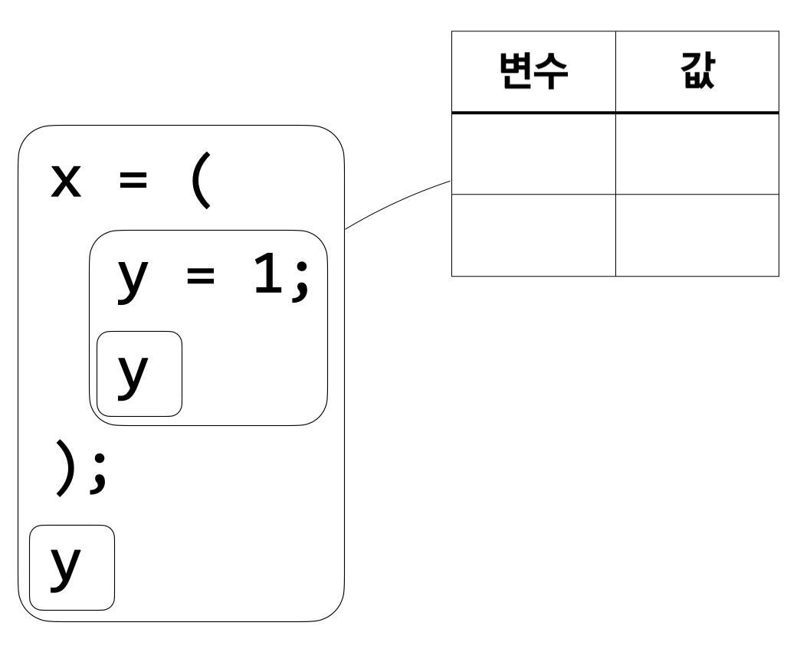
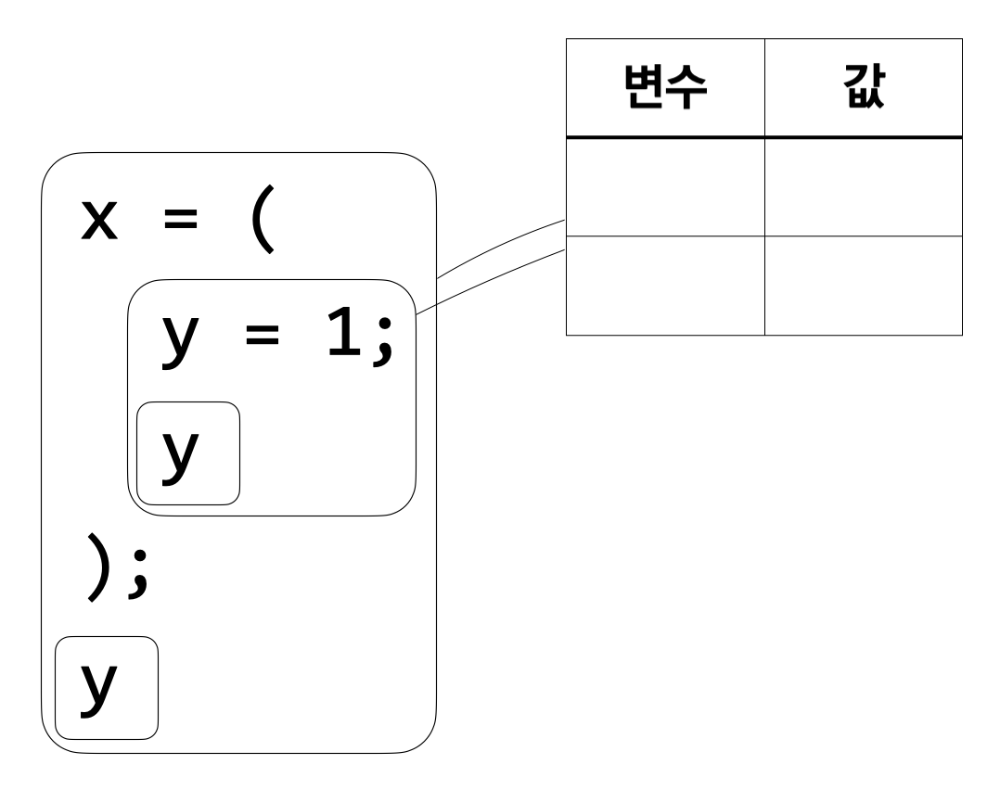
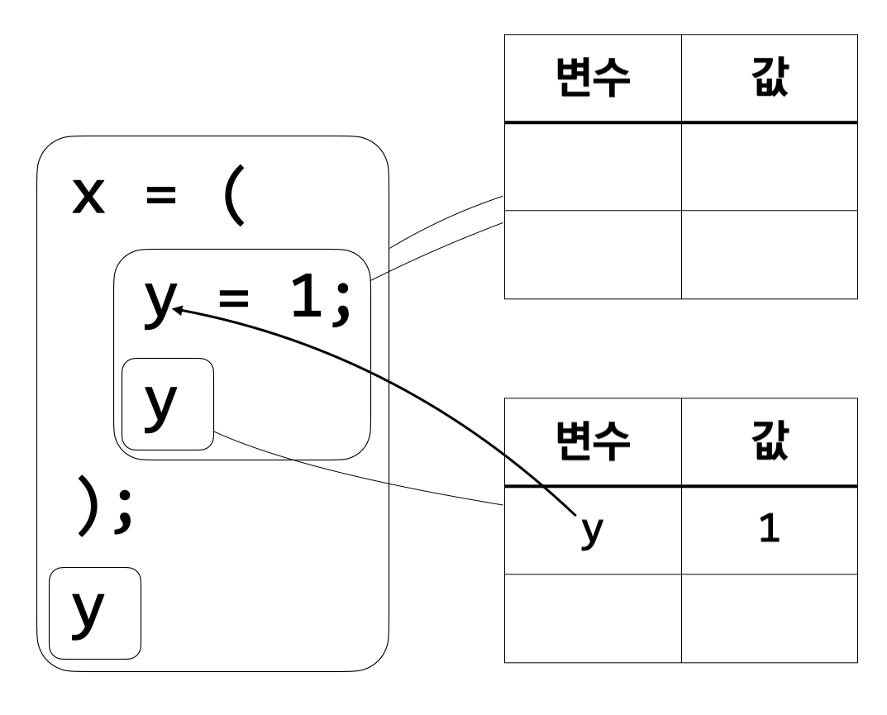
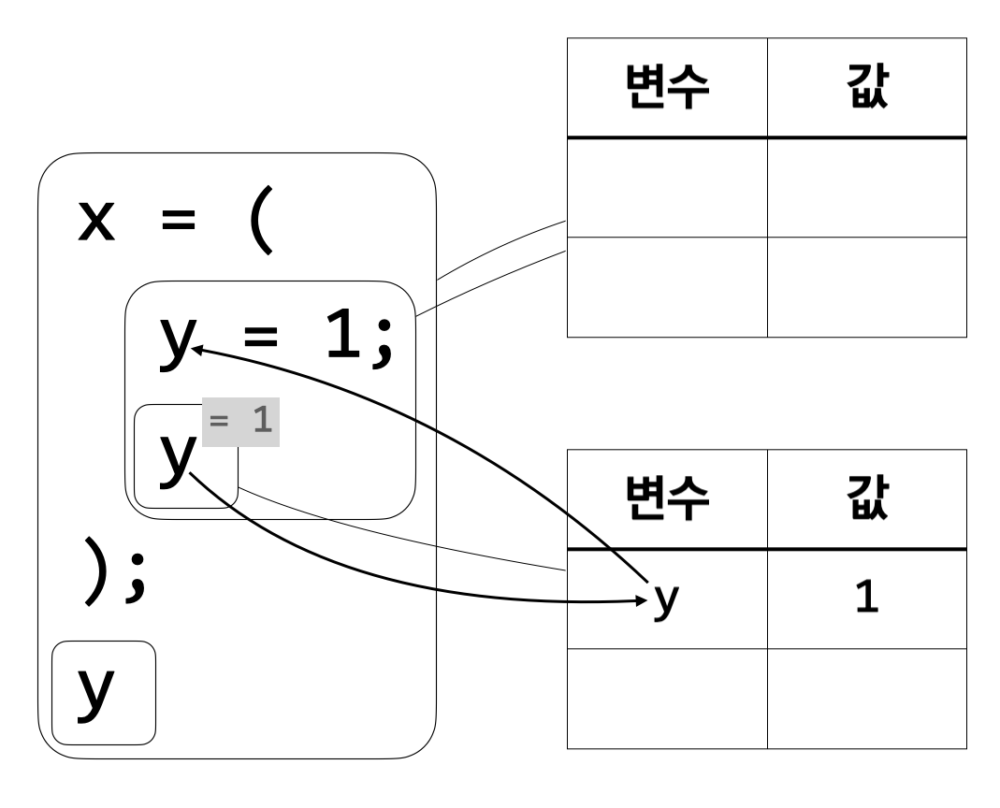
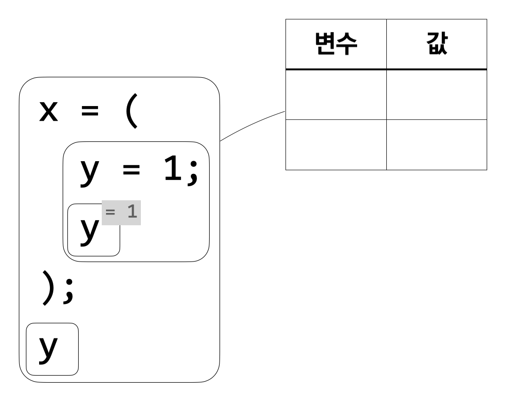
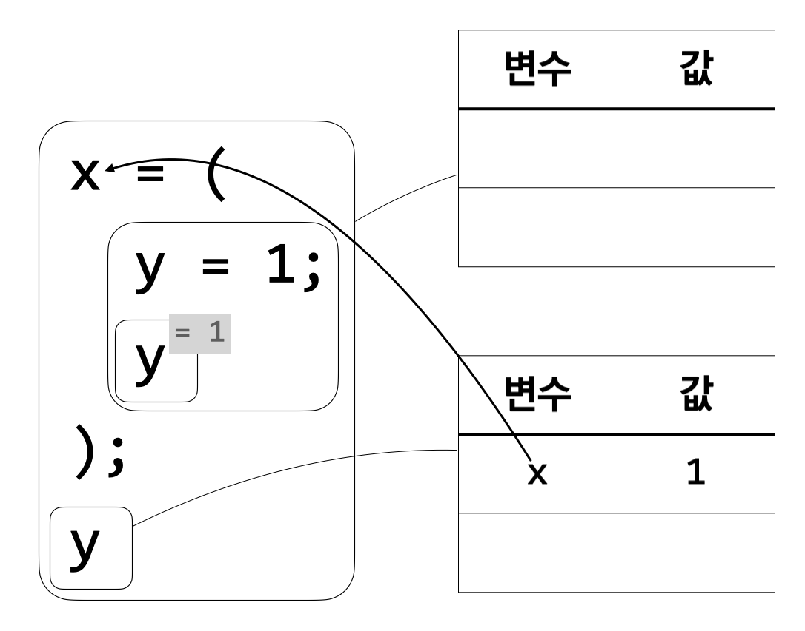

**아래 내용은 인사이트 출판사의 제안으로 작성 중인 책의 초고입니다. 실제 출판
시에는 내용이 달라질 수 있습니다. 많은 의견 부탁드립니다.**

변수를 식의 어딘가에서 정의했다고 해서 그 변수를 식의 모든 곳에서 사용할 수 있는
것은 아니다. 변수를 사용할 수 있는 곳을 그 변수의 영역(scope)이라고 부른다.
`산술x`에서 변수를 정의하는 식은 \(x = e_1; e_2\) 꼴이다. 여기서 \(e_2\)는 \(x\)의 영역이지만,
\(e_1\)은 \(x\)의 영역이 아니다. 이 점은 변수 정의의 의미를 정의하는 규칙 5를 보면
명확하다.

**규칙 5:**

\(\ \ \ \ \)\(\sigma\)에서 \(e_1\)의 실행 결과가 \(n_1\)이고

\(\ \ \ \ \)\(\sigma\)에 \(x\)의 값이 \(n_1\)이라는 정보를 추가해 만들어진 환경이 \(\sigma'\)이고

\(\ \ \ \ \)\(\sigma'\)에서 \(e_2\)의 실행 결과가 \(n_2\)이면,

\(\ \ \ \ \)\(\sigma\)에서 \(x = e_1; e_2\)의 실행 결과가 \(n_2\)이다.

\(e_1\)의 실행 결과는 \(\sigma\)에서 계산되므로 \(e_1\)을 계산할 때는 환경에 \(x\)의 값이 없다.
반면, \(e_2\)의 실행 결과는 \(\sigma'\)에서 계산되므로 \(e_2\)를 계산할 때는 환경에 \(x\)의 값이
있다. 그러므로 \(x\)의 영역에는 \(e_2\)만이 포함되는 것이다. 예를 들어 \({\tt x} = {\tt x}; {\tt x}\)라는
식을 생각해 보자. 마지막 \(\tt x\)는 \(\tt x\)의 영역이 맞지만, 두 번째 \(\tt x\)는 \(\tt x\)의 영역이 아니고,
따라서 자유 변수이다. 그러므로 이 식은 계산할 수 없는 식이다.

\(x = e_1; e_2\)에서 \(e_1\)도 \(x\)의 영역에 포함하도록 언어를 고칠 수 있을까? 얼핏
생각하기에 \(e_1\)이 \(x\)의 영역에 포함되는 것은 매우 이상한 일이다. \(x\)의 값을 정하는
식이 \(e_1\)인데 \(e_1\)이 \(x\)를 사용한다니 앞뒤가 맞지 않는다. 그러나 이는 사실
프로그래밍을 해 본 사람이라면 누구나 익숙할 만한 개념으로, \(x\)를
재귀적(recursive)으로 정의하는 것이다. \(x\)의 정의가 자기 자신을 필요로 하므로 \(x\)는
재귀적이다. 하지만 재귀(recursion)는 이번 장에서 다루고자 하는 개념이 아니다.
지금은 `산술x`의 의미를 그대로 두고 넘어가겠다. 재귀에 대해서는 6장에서 자세히
살펴볼 것이다.

`산술x`에서 변수의 영역은 그 변수를 정의하는 식을 벗어날 수 없다. 예를 들어,
다음과 같은 `산술x` 식을 생각해 보자.

\({\tt x} = (\)

\(\ \ {\tt y} = 1;\)

\(\ \ {\tt y}\)

\();\)

\({\tt y}\)

C나 파이썬 같은 명령형 언어(imperative language)에서는 보기 어려운 형태의 식이기
때문에, 위 식이 다소 어색하게 느껴지는 사람도 있을 것이다. 조금 어색할지라도,
`산술x`에서는 위의 식은 요약 문법을 따르는 식이다. 먼저, \({\tt y} = 1; {\tt y}\)는 앞에서도 많이
본, 변수를 정의하는 \(x = e_1; e_2\) 형태의 식이다. \({\tt y} = 1; {\tt y}\) 역시 \(1 + 2\)나 \(\tt x\) 등과
마찬가지로 하나의 `산술x` 식이라는 사실을 유의하자. 따라서 다시 \(x = e_1; e_2\)
형태의 식을 만들되, 정의하는 변수의 이름은 \(\tt x\), 그 변수의 값을 정하는 식은 \({\tt y} = 1;
{\tt y}\), 변수 \(\tt x\)를 사용하는 식은 \(\tt y\)로 하여 식을 만들면 위의 식이 나온다. 위의 식은
분명히 식의 중간에서 변수 \(\tt y\)를 정의한다. 그러나 마지막 \(\tt y\)는 자유 변수이다. 이는
\(\tt y\)의 영역에는 두 번째 \(\tt y\)만 포함되기 때문이다.

그림과 함께 왜 마지막 \(\tt y\)가 자유 변수인지 알아보자.

시작할 때의 환경은 비어 있다.

먼저 해야 할 일은 \({\tt y} = 1; {\tt y}\)를 계산하는 것이다. 아직 아무 변수도 정의하지 않았으니
이 식을 계산하는 것 역시 빈 환경에서 이루어진다.

\({\tt y} = 1\)에 따라 변수 \(\tt y\)의 값은 1이다. \(\tt y\)의 값은 두 번째 \(\tt y\)를 계산할 때 사용할 수 있다.
이를 위해 새로운 환경을 만들고 그 환경에 \(\tt y\)의 값이 1이라는 정보를 저장한다.

환경으로부터 \(\tt y\)의 값이 1임을 알 수 있으므로 \(\tt y\)를 계산하면 1이 나온다.

이제 \(\tt y\)의 값을 사용할 수 있는 구간이 끝났으므로 \(\tt y\)의 값을 저장한 환경은 더 이상
필요 없다.

\({\tt y} = 1; {\tt y}\)의 계산 결과가 1이므로 변수 \({\tt x}\)의 값이 1이다. \({\tt x}\)의 값을 마지막 \(\tt y\)를 계산할
때 사용할 수 있도록 새 환경을 만든다. 그 후 \(\tt y\)를 계산하려 하면 환경에 \(\tt y\)가
없으므로 마지막 \(\tt y\)가 자유 변수임을 알 수 있다.

`산술x`의 의미에 따라 계산해도 동일하게 마지막 \(\tt y\)가 자유 변수임을 알 수 있다. 빈
환경에서 \({\tt x} = ({\tt y} = 1; {\tt y}); {\tt y}\)의 실행 결과를 구하려면 먼저 빈 환경에서 \({\tt y} = 1; {\tt y}\)의
실행 결과를 찾아야 한다. 그 결과는 \(1\)이다. 그럼 남은 일은 빈 환경에 \({\tt x}\)의 값이
1이라는 정보를 추가하여 \([{\tt x}\mapsto1]\)라는 환경을 만들고 그 환경에서 \(\tt y\)를 계산하는
것이다. 보다시피 \([{\tt x}\mapsto1]\)에는 \(\tt y\)가 없다. 마지막 \(\tt y\)는 자유 변수인 것이다.
이처럼, \(x = e_1; e_2\) 형태로 변수를 정의했을 때, 그 변수의 영역은 \(e_2\)만을
포함하며, \(e_1\)은 물론이고 전체 식에서 \(e_2\)가 아닌 어떤 부분도 변수의 영역에
들어가지 않는다.
