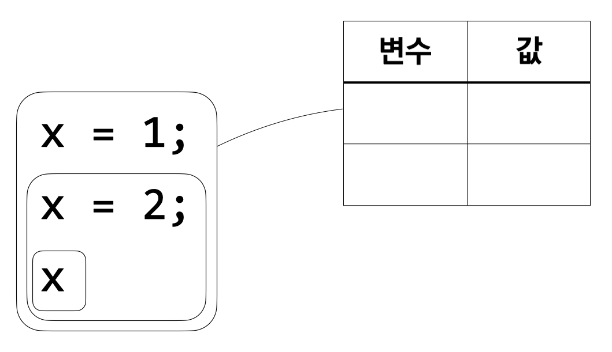
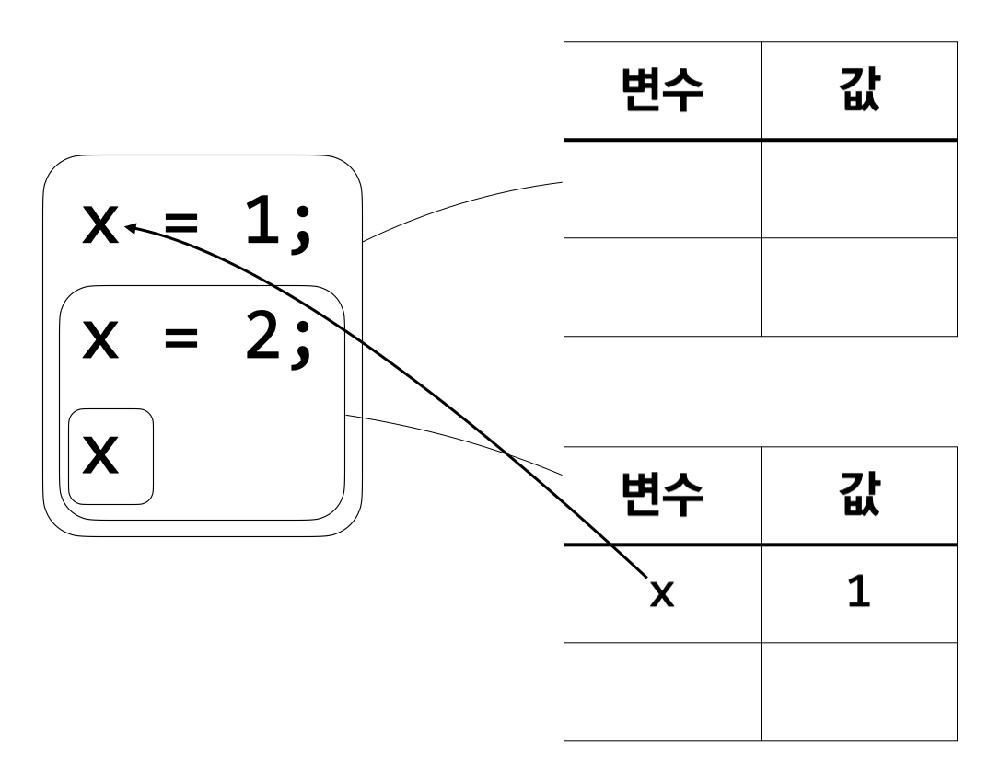
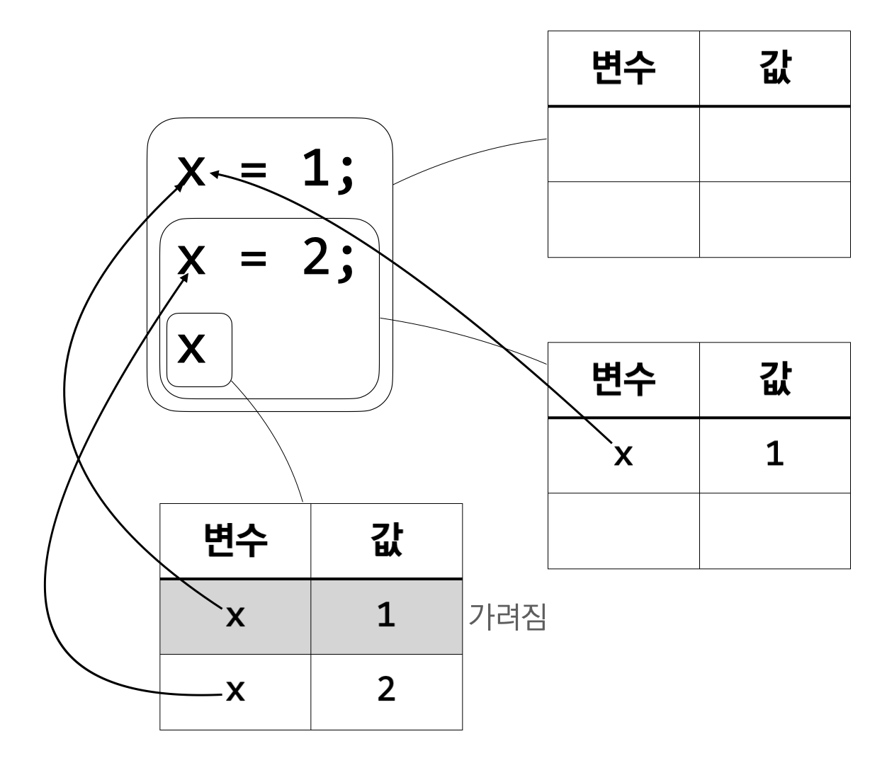
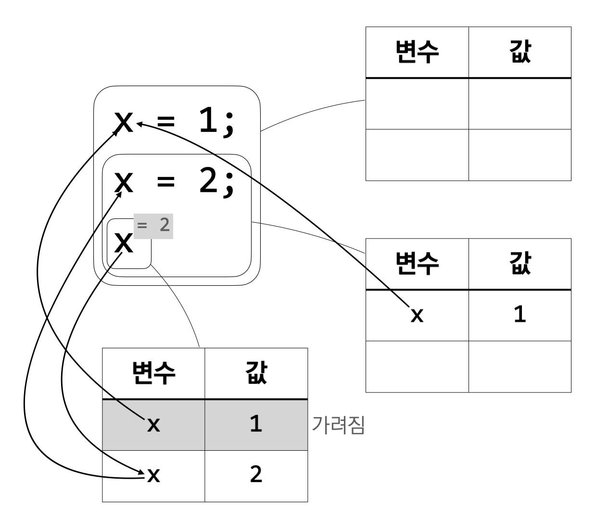

**아래 내용은 인사이트 출판사의 제안으로 작성 중인 책의 초고입니다. 실제 출판
시에는 내용이 달라질 수 있습니다. 많은 의견 부탁드립니다.**

지금까지 다룬 식들은 같은 이름의 변수를 두 번 이상 정의하지 않았다. 그러나 같은
이름의 변수를 두 번 이상 정의하는 식도 얼마든지 만들 수 있다. 요약 문법에서 그런
식을 배제하지 않기 때문이다. 만약 같은 이름의 변수가 두 번 이상 정의되면 각각의
영역이 겹치는 지점이 생길 수 있다.

다음의 식을 생각해 보자.

\({\tt x} = 1;\)

\({\tt x} = 2;\)

\(\tt x\)

이 식은 \({\tt x}\)라는 이름의 변수를 두 번 정의한다. 또, 두 \({\tt x}\)의 영역이 겹친다. 첫 \({\tt x}\)의
영역은 \({\tt x} = 2; {\tt x}\)이고 둘째 \({\tt x}\)의 영역은 \({\tt x}\)이므로 마지막 \({\tt x}\)은 첫 \({\tt x}\)의 영역에도 포함되고
둘째 \({\tt x}\)의 영역에도 포함된다. 그럼 여기서 마지막 \({\tt x}\)의 값은 무엇일까? `산술x`의 의미에
따라 계산해 보자.

* 가: (규칙 1에 따라) \([\ ]\)에서 \(1\)의 실행 결과가 \(1\)이다.
* 나: \([\ ]\)에 \({\tt x}\)가 \(1\)이라는 정보를 추가해 만들어진 환경이 \([{\tt x}\mapsto1]\)이다.
* 다: (규칙 1에 따라) \([{\tt x}\mapsto1]\)에서 \(2\)의 실행 결과가 \(2\)이다.
* 라: \([{\tt x}\mapsto1]\)에 \({\tt x}\)가 \(2\)라는 정보를 추가해 만들어진 환경이…….

계산을 하다 보면 \([{\tt x}\mapsto1]\)에 \({\tt x}\)가 \(2\)라는 정보를 추가하는 부분에서 막히고 만다.
이미 환경에 \({\tt x}\)가 들어 있을 때 다시 \({\tt x}\)를 추가하면 어떻게 되는지 정한 적이 없기
때문이다. 우리에게는 두 가지 선택지가 있다. 첫 번째는 \({\tt x}\)의 원래 값인 \(1\)을 그대로
두는 것이고, 두 번째는 새로 들어온 정보를 받아들여 \({\tt x}\)의 값을 \(2\)로 바꾸는 것이다.
둘 중에는 두 번째 선택지가 조금 더 합당해 보인다. \({\tt x}\)의 값을 바꾸지 않을 것이라면
\({\tt x}\)라는 이름의 변수를 여러 번 정의하는 것이 아무런 의미가 없다. 한 번 정의한
변수의 값을 바꿀 수도 없는데 다시 정의할 필요가 없는 것이다. 따라서 프로그래머가
같은 이름의 변수를 다시 정의한 데는 그 변수가 나타내는 값을 바꾸고 싶다는 의도가
있어 보인다. 그러므로 우리는 \([{\tt x}\mapsto1]\)에 \({\tt x}\)가 \(2\)라는 정보를 추가하여 만들어진
환경이 \([{\tt x}\mapsto2]\)인 것으로 약속하겠다. 이제 다시 계산을 이어 나갈 수 있다.

* 라: \([{\tt x}\mapsto1]\)에 \({\tt x}\)가 \(2\)라는 정보를 추가해 만들어진 환경이 \([{\tt x}\mapsto2]\)이다.
* 마: \([{\tt x}\mapsto2]\)에 \({\tt x}\)의 값이 \(2\)라는 정보가 있다.
* 바: (규칙 4에 따라) \([{\tt x}\mapsto2]\)에 \({\tt x}\)의 값이 \(2\)라는 정보가 있으면, \([{\tt x}\mapsto2]\)에서
\({\tt x}\)의 실행 결과가 \(2\)이다.
* 사: (마, 바에 따라) \([{\tt x}\mapsto2]\)에서 \({\tt x}\)의 실행 결과가 \(2\)이다.
* 아: (규칙 5에 따라) \([{\tt x}\mapsto1]\)에서 \(2\)의 실행 결과가 \(2\)이고 \([{\tt x}\mapsto1]\)에 \({\tt x}\)가
\(2\)라는 정보를 추가해 만들어진 환경이 \([{\tt x}\mapsto2]\)이고 \([{\tt x}\mapsto2]\)에서 \({\tt x}\)의 실행
결과가 \(2\)이면, \([{\tt x}\mapsto1]\)에서 \({\tt x} = 2; {\tt x}\)의 실행 결과가 \(2\)이다.
* 자: (다, 라, 사, 아에 따라) \([{\tt x}\mapsto1]\)에서 \({\tt x} = 2; {\tt x}\)의 실행 결과가 \(2\)이다.
* 차: (규칙 5에 따라) \([\ ]\)에서 \(1\)의 실행 결과가 \(1\)이고 \([\ ]\)에 \({\tt x}\)가 \(1\)이라는 정보를 추가해
만들어진 환경이 \([{\tt x}\mapsto1]\)이고 \([{\tt x}\mapsto1]\)에서 \({\tt x} = 2; {\tt x}\)의 실행 결과가 \(2\)이면,
\([{\tt x}\mapsto1]\)에서 \({\tt x} = 1; {\tt x} = 2; {\tt x}\)의 실행 결과가 \(2\)이다.
* 카: (가, 나, 자, 차에 따라) \({\tt x} = 1; {\tt x} = 2; {\tt x}\)의 실행 결과가 \(2\)이다.

위 과정에 따라 전체 식의 실행 결과는 \(2\)이며, 마지막 \({\tt x}\)의 값 역시 \(2\)임을 알 수 있다.
따라서, 마지막 \({\tt x}\)는 첫 \({\tt x}\)가 아닌 둘째 \({\tt x}\)에 묶여 있다.

위의 예시에서 알 수 있는 사실은, 마지막 \({\tt x}\)가 더 멀리 정의되어 있는 첫 \({\tt x}\)보다는 더
가까이에 정의된 둘째 \({\tt x}\)에 묶인다는 것이다. 이처럼, 두 변수의 영역이 겹칠 때는 더
가까이에, 또는 더 최근에, 정의된 변수가, 겹치는 영역에 등장하는 같은 이름의
변수의 값을 결정한다. 마치 새로운 정의가 기존의 정의를 가림으로써 변수의 값을
바꾸는 것 같다. 이런 이유로 가까이 정의된 변수가 멀리 정의된 변수에 우선하는
것을 가리기(shadowing)라고 부른다. 가리기 역시 대부분의 언어에서 볼 수 있는
개념이다.

그림으로 보면 더 직관적으로 가리기를 이해할 수 있다.

처음에는 환경이 비어 있다.

\({\tt x} = 1\)이 \({\tt x}\)라는 이름의 변수를 정의한다. \({\tt x}\)의 값이 1이며 그 값을 \({\tt x} = 2; {\tt x}\)를 계산하는
데 사용할 수 있으므로 새로운 환경을 만들고 \({\tt x}\)의 값을 넣는다.

이제 \({\tt x} = 2\)가 \({\tt x}\)라는 이름의 변수를 새로 정의한다. 이제 \({\tt x}\)의 값이 \(2\)이며 그 값을 \({\tt x}\)를
계산하는 데 사용할 수 있다. 새로운 환경을 만들고, 우선 현재 환경이 가지고 있는
정보를 모두 복사한다. 그러면 \({\tt x}\)의 값이 \(1\)이라는 정보가 들어 있게 된다. 기존
환경으로부터 정보를 복사하는 과정은 반드시 필요하다. \({\tt x} = 1; {\tt y} = 2; {\tt x}\) 같은 식을
생각해 보면 그 이유를 알 수 있을 것이다. 그 다음은 \({\tt x}\)의 값이 \(2\)라는 정보를 추가할
차례이다. \({\tt x}\)의 값이 \(2\)라는 정보를 넣고 나면 기존에 있던 \({\tt x}\)의 값이 \(1\)이라는 정보가
가려진다.

마지막으로 \({\tt x}\)가 계산되며 환경으로부터 그 값이 \(2\)임을 알 수 있다.

분명히 이번 장이 시작될 때 이번 장에서 다루는 변수는 수정 불가능한 변수라고
말했다. 그런데 지금 나온 가리기를 통해 변수를 수정할 수 있는 것이 아닌가 의문이
든 사람들도 있을 것이다. 결론부터 말하자면, 가리기는 변수를 수정하는 것이
아니다. 이름 그대로 이미 정의된 변수를 잠깐 ‘가릴’ 뿐이다. 가리기가 왜 변수
수정과는 다른지는 다음 예시를 통해 쉽게 알 수 있다.

\({\tt x} = 1;\)

\(({\tt x} = 2; {\tt x}) + {\tt x}\)

이 식의 계산 결과는 \(4\)가 아닌 \(3\)이다. 첫 \({\tt x}\)의 영역은 \(({\tt x} = 2; {\tt x}) + {\tt x}\)이고 둘째 \({\tt x}\)의
영역은 \({\tt x}\)이다. 셋째 \({\tt x}\)는 두 영역에 모두 포함되며 둘째 \({\tt x}\)가 첫 \({\tt x}\)보다 가깝다. 따라서
셋째 \({\tt x}\)는 둘째 \({\tt x}\)에 묶여 있고 그 값은 \(2\)이다. 한편, 마지막 \({\tt x}\)는 첫 \({\tt x}\)의 영역에만
포함되므로 첫 \({\tt x}\)에 묶여 있고 그 값은 \(1\)이다. 따라서 전체 식의 결과가 \(3\)인 것이다.
예시에서 볼 수 있듯이 \({\tt x} = 2\)라고 정의한 것은 셋째 \({\tt x}\)에만 영향을 준다. 앞에서 말한
것처럼 변수의 영역은 그 변수를 정의하는 식을 벗어나지 못하기 때문이다. 그렇기에
마지막 \({\tt x}\)는 위치상으로는 \({\tt x} = 2\) 다음에 옴에도 그 값이 \(2\)가 아니라 \(1\)이다. 만약 \({\tt x} =
2\)라고 쓴 것이 가리기가 아니라 이미 정의된 \({\tt x}\)를 수정하는 것이라면 마지막 \({\tt x}\) 역시
값을 수정한 것에 영향받아 값이 \(1\)이 아니라 \(2\)가 될 것이다. 이처럼, 가리기는 나중에
정의된 변수가 자신의 영역 안에서만 먼저 정의된 변수를 잠시 가리는 개념이지만,
변수 수정은 프로그램 전역에 영구적으로 영향을 주도록 진짜로 한 변수의 값을
바꾸는 개념이다. 변수 수정에 대해서는 7장에서 자세히 살펴보겠다.
